# FinnGen 3 Olink Proteomics Analysis Pipeline

**Platform**: Olink Explore HT (5K)

**Version**: 1.0.0

**Release Date**: January 2026

**Author**: Reza Jabal, PhD (rjabal@broadinstitute.org)

**Reviewer**: Mitja Kurki, PhD (mkurki@broadinstitute.org)

## Overview

A comprehensive, Docker-ready R pipeline for analyzing Olink Explore HT (5K) proteomics data. This production-ready workflow provides a complete quality control and normalization pipeline for proteomics data analysis.

**Key Features:**
- **Comprehensive QC Pipeline**: Multi-stage quality control with PCA, technical, Z-score, sex mismatch, and pQTL-based outlier detection
- **QC Machine Components**: Technical Outlier Check [PCA → Technical → Z-score] → Sample Provenance Check[Sex Outliers → pQTL-based Outliers]
- **Fully Configurable**: All paths and parameters configured via YAML config file
- **Docker-Ready**: Complete Docker setup with automated builds
- **Multi-Batch Support**: Process and harmonize multiple batches with bridge sample normalization
- **Comprehensive QC Reporting**: Integrated outlier tracking with detailed metrics and annotations

**Pipeline Summary:**
After comprehensive quality control including PCA outlier detection, technical outlier detection, Z-score outlier detection, sex mismatch detection, and pQTL-based outlier detection, typically **~96-97% of analysis-ready samples** pass all QC filters and are retained for downstream analysis.

**Expected Results** (based on FG3 Batch 2):
- **Input**: 2,522 analysis-ready samples (2,477 FinnGen + 50 bridge samples)
- **Final QCed**: ~2,441 samples (96.8% retention rate)
- **Proteins**: 5,440 (all proteins retained through QC)

## Pipeline Architecture

### Single-Batch Mode Flow

```mermaid
flowchart TD
    Start([Start]) --> Loader[00_data_loader.R<br/>Load NPX matrix<br/>Prepare analysis-ready data]

    Loader --> PCA[01_pca_outliers.R<br/>PCA analysis<br/>SD & IQR outlier detection]

    PCA --> Technical[02_technical_outliers.R<br/>Plate/batch/processing outliers<br/>Sample-level QC]

    Technical --> Zscore[03_zscore_outliers.R<br/>Z-score outliers<br/>Iterative detection]

    Zscore --> Sex[04_sex_outliers.R<br/>Sex mismatch detection<br/>Protein & genetic evidence]

    Sex --> PqtlTrain{05a_pqtl_training.R<br/>Optional: pQTL training<br/>Can be disabled}

    PqtlTrain -->|Enabled| PqtlTrainRun[pQTL Training<br/>Consensus selection]
    PqtlTrain -->|Disabled| PqtlOutliers

    PqtlTrainRun --> PqtlOutliers[05b_pqtl_outliers.R<br/>pQTL-based outlier detection<br/>MeanAbsZ assignment]

    PqtlOutliers --> Provenance{05c_provenance_test.R<br/>Optional: Provenance test<br/>Can be disabled}

    Provenance -->|Enabled| ProvenanceRun[Provenance Test]
    Provenance -->|Disabled| QCReport

    ProvenanceRun --> QCReport[05d_qc_comprehensive_report.R<br/>Comprehensive QC report<br/>Integrated outlier tracking]

    QCReport --> Normalize[06_normalize_data.R<br/>Data normalization<br/>Median/ComBat options]

    Normalize --> BridgeNorm{07_bridge_normalization.R<br/>Optional: Multi-batch only<br/>Enhanced bridge methods}

    BridgeNorm -->|Enabled| BridgeNormRun[Enhanced Bridge<br/>Quantile normalization]
    BridgeNorm -->|Disabled| Covariate

    BridgeNormRun --> Covariate[08_covariate_adjustment.R<br/>Adjust for age/sex/BMI/smoking<br/>Proteomic PCs excluded]

    Covariate --> Phenotype[09_prepare_phenotypes.R<br/>Combine QC results<br/>Create phenotype matrix]

    Phenotype --> Kinship[10_kinship_filtering.R<br/>Remove related individuals<br/>3rd degree threshold]

    Kinship --> Rank[11_rank_normalize.R<br/>Inverse rank normalization<br/>PLINK format output]

    Rank --> Output([Analysis Ready<br/>Phenotypes])

    style Start fill:#e1f5e1
    style Output fill:#ffe1e1
    style PCA fill:#e1f4ff
    style Technical fill:#e1f4ff
    style Zscore fill:#e1f4ff
    style Sex fill:#e1f4ff
    style PqtlTrain fill:#fff4e1
    style PqtlTrainRun fill:#e1f4ff
    style PqtlOutliers fill:#e1f4ff
    style Provenance fill:#fff4e1
    style ProvenanceRun fill:#e1f4ff
    style QCReport fill:#e1f4ff
    style Normalize fill:#f4e1ff
    style BridgeNorm fill:#f4e1ff
    style Covariate fill:#f4e1ff
```



### Multi-Batch Mode Flow

```mermaid
flowchart TD
    Start([Multi-Batch Mode Start]) --> RefBatch[Reference Batch<br/>batch_02]
    Start --> OtherBatch[Other Batches<br/>batch_01, ...]

    %% Reference Batch Processing (Sequential)
    RefBatch --> Ref00[00_data_loader.R<br/>Load NPX matrix<br/>Prepare data]
    Ref00 --> Ref01[01_pca_outliers.R<br/>PCA outlier detection]
    Ref01 --> Ref02[02_technical_outliers.R<br/>Technical outlier detection]
    Ref02 --> Ref03[03_zscore_outliers.R<br/>Z-score outlier detection]
    Ref03 --> Ref04[04_sex_outliers.R<br/>Sex mismatch detection]
    Ref04 --> Ref05a{05a_pqtl_training.R<br/>Optional: pQTL training}
    Ref05a -->|Enabled| Ref05aRun[pQTL Training]
    Ref05a -->|Disabled| Ref05
    Ref05aRun --> Ref05[05b_pqtl_outliers.R<br/>pQTL-based outlier detection]
    Ref05 --> Ref05c{05c_provenance_test.R<br/>Optional: Provenance test}
    Ref05c -->|Enabled| Ref05cRun[Provenance Test]
    Ref05c -->|Disabled| Ref05d
    Ref05cRun --> Ref05d[05d_qc_comprehensive_report.R<br/>Comprehensive QC report]
    Ref05d --> Ref06[06_normalize_data.R<br/>Single-batch normalization]
    Ref06 --> Ref07[07_bridge_normalization.R<br/>Enhanced bridge normalization]
    Ref07 --> Ref08[08_covariate_adjustment.R<br/>Covariate adjustment]
    Ref08 --> Ref09[09_prepare_phenotypes.R<br/>Prepare phenotypes]
    Ref09 --> Ref10[10_kinship_filtering.R<br/>Remove related individuals]
    Ref10 --> Ref11[11_rank_normalize.R<br/>Rank normalization]
    Ref11 --> RefComplete([Reference Batch<br/>Complete])

    %% Other Batch Processing
    OtherBatch --> Other00[00_data_loader.R<br/>Load NPX matrix<br/>Prepare data]
    Other00 --> Other01[01_pca_outliers.R<br/>PCA outlier detection]
    Other01 --> Other02[02_technical_outliers.R<br/>Technical outlier detection]
    Other02 --> Other03[03_zscore_outliers.R<br/>Z-score outlier detection]
    Other03 --> Other04[04_sex_outliers.R<br/>Sex mismatch detection]
    Other04 --> Other05a{05a_pqtl_training.R<br/>Optional: pQTL training}
    Other05a -->|Enabled| Other05aRun[pQTL Training]
    Other05a -->|Disabled| Other05
    Other05aRun --> Other05[05b_pqtl_outliers.R<br/>pQTL-based outlier detection]
    Other05 --> Other05c{05c_provenance_test.R<br/>Optional: Provenance test}
    Other05c -->|Enabled| Other05cRun[Provenance Test]
    Other05c -->|Disabled| Other05d
    Other05cRun --> Other05d[05d_qc_comprehensive_report.R<br/>Comprehensive QC report]
    Other05d --> Other06[06_normalize_data.R<br/>Multi-batch normalization<br/>Uses: Bridge samples from both batches]
    Other06 --> Other07[07_bridge_normalization.R<br/>Enhanced bridge normalization<br/>Uses: QCed data from both batches]
    Other07 --> Other08[08_covariate_adjustment.R<br/>Covariate adjustment]
    Other08 --> Other09[09_prepare_phenotypes.R<br/>Prepare phenotypes]
    Other09 --> Other10[10_kinship_filtering.R<br/>Remove related individuals]
    Other10 --> Other11[11_rank_normalize.R<br/>Rank normalization]
    Other11 --> OtherComplete([Other Batch<br/>Complete])

    %% Aggregation (Optional)
    RefComplete --> AggCheck{Aggregation<br/>Enabled?}
    OtherComplete --> AggCheck
    AggCheck -->|Yes| Agg09[09_prepare_phenotypes.R<br/>Aggregate: Merge matrices<br/>Common proteins only]
    AggCheck -->|No| BatchOutput([Batch-Specific<br/>Outputs])
    Agg09 --> Agg10[10_kinship_filtering.R<br/>Filter related from aggregate]
    Agg10 --> Agg11[11_rank_normalize.R<br/>Rank normalize aggregate]
    Agg11 --> AggregateOutput([Aggregate<br/>Output])

    %% Styling
    style Start fill:#e1f5e1
    style RefBatch fill:#fff4e1
    style OtherBatch fill:#fff4e1
    style Ref05a fill:#fff4e1
    style Ref05aRun fill:#e1f4ff
    style Ref05 fill:#e1f4ff
    style Ref05c fill:#fff4e1
    style Ref05cRun fill:#e1f4ff
    style Ref05d fill:#e1f4ff
    style Other05a fill:#fff4e1
    style Other05aRun fill:#e1f4ff
    style Other05 fill:#e1f4ff
    style Other05c fill:#fff4e1
    style Other05cRun fill:#e1f4ff
    style Other05d fill:#e1f4ff
    style Other06 fill:#f4e1ff
    style Other07 fill:#f4e1ff
    style AggCheck fill:#ffe1e1
    style AggregateOutput fill:#ffe1e1
    style BatchOutput fill:#ffe1e1
    style RefComplete fill:#e1f5e1
    style OtherComplete fill:#e1f5e1
```



## Quality Control Strategy

The pipeline implements a **two-component QC strategy**:

1. **Technical Outlier Detection** (Steps 01-03): Operates on the same base matrix (analysis-ready samples) to avoid cascading bias. Methods include:
   - PCA-based outlier detection
   - Technical outlier detection (plate, batch, processing time, sample-level)
   - Z-score outlier detection

2. **Provenance Steps** (Steps 04-05): Operate sequentially on the PCA-cleaned matrix to identify mismatches and probable sample swaps using samples that have already passed technical quality filters:
   - Sex mismatch detection
   - pQTL-based outlier detection

All samples are flagged but not removed until final QC integration (Step 05d), which combines all flags using union logic and removes flagged samples from the base matrix.

## Pipeline Steps

### Phase 1: Data Loading

#### 00_data_loader.R
- **Purpose**: Load NPX matrix and prepare analysis-ready data
- **Input**:
  - NPX matrix (Parquet format)
  - Metadata file (TSV format)
  - Optional: Bridging sample information
- **Output**:
  - `00_npx_matrix_analysis_ready.rds`: Analysis-ready NPX matrix
  - `00_metadata.rds`: Sample metadata
  - `00_sample_mapping.tsv`: Sample mapping with FINNGENIDs
  - `00_samples_data_raw.rds`: Raw sample-level data (if available)

**Expected Sample Composition**:
- FinnGen samples: ~96% of biological samples
- Bridge samples: ~2% (for cross-batch harmonization)
- Non-FinnGen samples: Excluded from analysis

### Phase 2: Quality Control

#### 01_pca_outliers.R
- **Purpose**: PCA-based outlier detection
- **Methods**:
  - PC1 & PC2 thresholds: mean ± 5 SD after Olink scaling
  - PC3 & PC4 thresholds: mean ± 5 SD
  - Sample median filter: median across proteins per sample within mean ± 5 SD
  - Sample IQR filter: IQR across proteins per sample within mean ± 5 SD
  - Removals are sequential; the final outlier set is the union of all removals
- **Threshold**: 5×SD
- **Rationale**: Provides ~99.9999% specificity under normal distribution, more lenient than 4×SD to preserve samples with moderate expression pattern deviations whilst catching extreme outliers. This threshold balances sensitivity and specificity for high-throughput proteomics data.
- **PC Scaling**: Principal components PC1 and PC2 are scaled using:

  ```
  PC_i^scaled = PC_i / (σ_PC_i × √n)
  ```

  where σ_PC_i is the standard deviation of PC_i and n is the number of samples (follows Olink documentation).
- **Expected Results**: ~0.95% of analysis-ready samples flagged (e.g., 24/2,522)
- **Output**:
  - `01_npx_matrix_pca_cleaned.rds`: PCA-cleaned matrix
  - `01_pca_outliers_by_source.tsv`: Identified outliers
  - `01_pca_result.rds`: PCA results with PCs

#### 02_technical_outliers.R
- **Purpose**: Identify technical outliers using multiple orthogonal quality metrics
- **Detection Methods**:
  1. **Plate-level outliers** (5×MAD ≈ 4×SD): Flags all samples from outlier plates
  2. **Batch effects** (5×MAD ≈ 4×SD): Identifies temporal batch effects by collection month
  3. **Processing time outliers** (5×MAD ≈ 4×SD): Samples with abnormal collection-to-freezing times
  4. **Sample-level outliers** (OR logic):
     - Mean NPX outliers (5×MAD, two-sided)
     - SD outliers (4×MAD, one-sided upper)
     - Missing rate (>5%)
     - QC failure rate (>30%)
- **Threshold Rationale**:
  - **5×MAD ≈ 4×SD**: For normal distributions, MAD/SD ≈ 0.798, therefore 5×MAD ≈ 3.99×SD ≈ 4×SD. This harmonizes with the |Z| > 4 threshold used in Z-score outlier detection, ensuring consistent stringency (~99.994% specificity) across all outlier detection methods.
  - **5% missing rate threshold**: More stringent than initial QC's 10% threshold, catching samples with borderline missing data (5-10%) that may indicate quality degradation.
  - **30% QC failure rate**: Represents a clear quality failure threshold where samples have substantial measurement problems flagged by Olink's QC system.
- **Note to Analysts**: High variance (SD outliers) may indicate technical measurement instability, but can also reflect genuine biological heterogeneity (e.g., acute disease states, dynamic physiological processes). Analysts should evaluate these samples in their biological context before exclusion.
- **Expected Results**: ~1.07% of analysis-ready samples flagged (e.g., 27/2,522)
- **Output**:
  - `02_npx_matrix_technical_cleaned.rds`: Technical-cleaned matrix
  - `02_technical_outlier_summary.tsv`: All flagged samples with source flags
  - `02_plate_statistics.tsv`: Per-plate statistics
  - `02_sample_technical_stats.tsv`: Per-sample statistics

#### 03_zscore_outliers.R
- **Purpose**: Protein-centric outlier detection using per-protein Z-scores
- **Method**:
  1. Calculate per-protein Z-scores: `Z = (NPX - protein_mean) / protein_SD`
  2. Flag extreme values: `|Z| > 4`
  3. Sample-level aggregation: Count proteins with extreme Z-scores per sample
  4. Iterative refinement: Remove outliers and recalculate (up to 5 iterations)
- **Threshold**: `|Z| > 4` for >10% of proteins (>544/5440)
- **Rationale**:
  - **|Z| > 4 threshold**: Aligned with 5×MAD threshold from Technical Outlier Detection for consistency. More stringent than typical 3×SD (99.7%) to reduce false positives in high-throughput data.
  - **>10% proteins threshold**: Requires samples to have extreme values across many proteins, preventing flagging of samples with isolated extreme measurements (which may be biologically valid). Indicates systematic measurement issues, sample degradation, or contamination.
- **Expected Results**: ~0.28% of analysis-ready samples flagged (e.g., 7/2,522)
- **Output**:
  - `03_npx_matrix_zscore_cleaned.rds`: Z-score-cleaned matrix
  - `03_zscore_outliers_list.tsv`: Z-score outliers
  - `03_zscore_outlier_summary.tsv`: Per-sample outlier counts

#### 04_sex_outliers.R
- **Purpose**: Detect sex mismatches and sex-based outliers using proteomics-only prediction
- **Input Matrix**: Uses PCA-cleaned matrix (with fallback to analysis-ready matrix). This sequential approach ensures that sex prediction models are trained on samples that have already passed technical quality filters, improving model robustness.
- **Method** (leakage-safe nested cross-validation):
  - **Univariate Discovery**: Per-protein logistic regression with age, BMI, smoking, PCs
  - **Predictive Modeling**: Elastic Net with nested CV (5-fold outer, 5-fold inner)
  - **Model Performance**: Typically achieves AUC ≈ 0.9999 (near-perfect separation)
  - **Training Samples**: Excludes missing genetic sex, F64 cohort, and chromosomal abnormalities from training
- **Two-Tier QC Approach**:
  1. **Strict Mismatches** (predicted_sex ≠ genetic_sex):
     - Definition: Samples where predicted sex label (based on 0.5 probability threshold) differs from genetic sex
     - Logic: `predicted_sex != genetic_sex`
     - Purpose: Identify actual classification errors
     - Expected: ~0.72% of PCA-cleaned samples (e.g., 18/2,498)
  2. **Sex Outliers** (threshold-based deviations, NOT strict mismatches):
     - Definition: Samples where predicted female probability deviates from expected thresholds but predicted_sex still matches genetic_sex
     - Purpose: Identify borderline cases with unusual predicted probabilities
     - Expected: ~0.52% of PCA-cleaned samples (e.g., 13/2,498)
- **Note to Analysts**: Biological factors beyond sample swaps can produce sex-atypical proteomic profiles. This includes samples from individuals undergoing gender-affirming hormone therapy, paediatric samples (where sex-specific signatures may be less pronounced), and individuals with sex chromosome abnormalities. These flags reflect biological variation rather than technical errors. Analysts should evaluate flagged samples in their clinical and developmental context before exclusion.
- **Output**:
  - `04_sex_predictions.tsv`: All samples with predicted probabilities
  - `04_sex_mismatches.tsv`: Union of mismatches and sex outliers
  - `04_sex_associated_proteins.tsv`: Univariate discovery results
  - `04_npx_matrix_sex_cleaned.rds`: Sex-cleaned matrix

#### 05b_pqtl_outliers.R
- **Purpose**: Identify sample mismatches by comparing observed vs genotype-predicted protein levels
- **Input Matrix**: Uses PCA-cleaned matrix (with fallback to analysis-ready matrix). This sequential approach ensures consistency with Sex Outlier Detection and improves robustness by removing technical outliers that could confound mismatch identification.
- **Method**:
  1. Applies Inverse Rank Normalization (IRN) to protein expression
  2. Loads consensus pQTLs from Step 05a (or selects top N pQTLs with MAF > 20%)
  3. Extracts genotypes for selected pQTL variants
  4. Calculates expected protein levels per genotype
  5. Computes Z-scores: `Z = (observed - expected_mean) / expected_SD`
  6. Aggregates using **MeanAbsZ** (exclusively used for outlier assignment)
- **pQTL Selection**:
  - Uses consensus pQTLs from Step 05a when available
  - Otherwise selects top N pQTLs (default: 200) with MAF > 20% based on composite score: `(-log10(p) × |beta| × maf) / (heterozygosity + 0.01)`
- **Mean Absolute Z-score (MeanAbsZ)**:
  - Calculation: `MeanAbsZ = mean(|Z|)` across all pQTL variants for each sample
  - Threshold: Population mean + 4×SD (rounded to 1 decimal place)
  - **Note**: Uses standard deviation (SD), not median absolute deviation (MAD), for consistency with normal distribution assumptions. For comparison, 4×SD ≈ 5×MAD (since MAD/SD ≈ 0.798 for normal distributions).
  - **Outlier assignment**: EXCLUSIVELY based on this metric
- **Note to Analysts**: Outliers could be potential sample swaps or other technical issues causing discordance between observed protein levels and genotype-predicted levels. Analysts should review flagged samples with metadata on disease state, treatment history, and sample type before attributing discordance solely to technical error.
- **Expected Results**: ~0.56% of PCA-cleaned samples flagged (e.g., 14/2,498)
- **Output**:
  - `05b_pqtl_outliers.tsv`: Samples flagged as outliers (MeanAbsZ-based)
  - `05b_pqtl_stats.tsv`: Full statistics for all samples
  - `05b_npx_matrix_pqtl_cleaned.rds`: pQTL-cleaned matrix

#### 05a_pqtl_training.R (Optional)
- **Purpose**: Train pQTL selection criteria using stability selection with LASSO
- **When to run**: Typically run once to establish consensus pQTLs, then disabled
- **Output**:
  - `05a_consensus_config.yaml`: Consensus pQTL configuration
  - Training metrics and stability selection results

#### 05c_provenance_test.R (Optional)
- **Purpose**: Provenance/governance component validation test
- **When to run**: Testing and validation, can be disabled in production

#### 05d_qc_comprehensive_report.R
- **Purpose**: Generate comprehensive QC reports after all outlier detection steps
- **Control Probe Handling**:
  - The pipeline identifies and can remove control probes (Incubation, Extension, and Amplification controls) from outputs
  - Control probe removal is configurable via `parameters.qc.remove_control_probes` (default: `true`)
  - When enabled, creates separate "biological-only" outputs without control probes
- **Key Features**:
  - Creates binary QC flag columns for each step (QC_initial_qc, QC_pca, QC_sex_mismatch, QC_sex_outlier, QC_technical, QC_zscore, QC_pqtl)
  - Generates integrated outlier tracking table with detection method annotations
  - Annotates original metadata with QC flags and raw metrics from all steps
  - Creates clean NPX matrix with all flagged samples removed
  - Outputs data in both TSV and Parquet formats for flexibility
- **Outlier Aggregation**:
  - Technical outlier detection (PCA, Technical, Z-score): Operate on the same base matrix, flagging outliers but not removing them
  - Provenance steps (Sex, pQTL): Operate sequentially on the PCA-cleaned matrix
  - Final QC integration combines all outlier lists using union logic
  - Samples flagged by multiple methods provide high-confidence outlier identification
- **Expected Results**:
  - Total samples tracked: Analysis-ready samples + Initial QC FINNGEN failures
  - Unique samples flagged: ~3.4% of analysis-ready samples (e.g., 86/2,522)
  - Samples flagged by multiple methods: ~17% of all flagged samples (e.g., 15/86)
  - Final clean dataset: ~96.8% retention rate (e.g., 2,441/2,522)
- **Output**:
  - `05d_comprehensive_outliers_list.tsv` / `.parquet`: All flagged samples with QC annotations
  - `05d_qc_annotated_metadata.tsv` / `.parquet`: Metadata with QC flags and metrics
  - `05d_npx_matrix_all_qc_passed.rds`: Clean matrix with all QC-passed samples (includes all proteins: 5,440 proteins including control probes)
  - `05d_npx_matrix_all_qc_passed_biological_only.rds` / `.parquet` / `.tsv`: Biological-only matrix (control probes removed, typically 5,416 proteins)
    - **Note**: This output is only created when `parameters.qc.remove_control_probes: true` (default)
    - Control probes removed: Incubation controls, Extension controls, Amplification controls
    - The exact number of biological proteins may vary depending on the input data panel

### Phase 3: Normalization

#### 06_normalize_data.R
- **Purpose**: Cross-batch/cross-plate harmonization to remove technical variability
- **Methods**:
  1. **Median Normalization** (recommended): Per-protein median scaling
  2. **Bridge Normalization**: Uses bridge samples as reference standards
  3. **ComBat Batch Correction**: Parametric empirical Bayes framework
- **Evaluation**: Coefficient of Variation (CV) reduction
- **Expected Performance**: Median normalization typically achieves ~9.7% SD reduction (best performance)
- **Output**:
  - `06_npx_matrix_normalized_median.rds`: Median-normalized matrix (recommended)
  - `06_npx_matrix_normalized.rds`: Bridge-normalized matrix
  - `06_normalization_evaluations.tsv`: CV statistics before/after

#### 07_bridge_normalization.R (Optional - Multi-Batch Only)
- **Purpose**: Enhanced bridge sample normalization for multi-batch integration
- **When to run**: Only when integrating multiple batches (e.g., FG2 + FG3)
- **Methods**:
  - **Median method**: Quality-filtered bridge samples
  - **Quantile method**: Aligns entire distributions
- **Output**:
  - `07_npx_matrix_bridge_enhanced.rds`: Enhanced median normalized
  - `07_npx_matrix_bridge_quantile.rds`: Quantile normalized

#### 08_covariate_adjustment.R
- **Purpose**: Adjust for biological covariates (age, sex, BMI, smoking)
- **Covariates**: Age, sex, BMI, smoking status
- **Note**: Proteomic PCs are **NOT** adjusted for to preserve biological signal. They are evaluated and visualized but not removed from the data.
- **Output**:
  - `08_npx_matrix_adjusted.rds`: Covariate-adjusted matrix
  - `08_covariate_effects_summary.tsv`: Effect sizes

### Phase 4: Phenotype Preparation

#### 09_prepare_phenotypes.R
- **Purpose**: Combine all QC results and prepare phenotypes for GWAS
- **Features**:
  - Combines outliers from all detection methods
  - Creates FINNGENID-indexed matrices
  - **Multi-Batch Mode**: Merges batch matrices on common proteins
- **Output**:
  - `09_phenotype_matrix_finngenid.rds`: FINNGENID-indexed phenotype matrix
  - `09_all_outliers_removed.txt`: Combined outlier list

#### 10_kinship_filtering.R
- **Purpose**: Remove related individuals
- **Threshold**: 3rd degree relationship (0.0884 KING kinship coefficient)
- **Method**: Preferential retention based on data completeness
- **Note**: The QCed set of samples has **not** been kinship filtered by default. Related individuals (e.g., sample duplicates, siblings, parent-offspring pairs) may be present. Users requiring unrelated samples should apply kinship filtering separately.
- **Output**:
  - `10_phenotype_matrix_unrelated.rds`: Unrelated samples matrix
  - `10_relationship_summary.tsv`: Relationship statistics

#### 11_rank_normalize.R
- **Purpose**: Apply inverse rank normalization (IRN)
- **Features**:
  - Column-wise normalization per protein
  - Distribution comparison before/after
  - PLINK format output
- **Output**:
  - `11_phenotype_matrix_rint.rds`: Rank-normalized matrix
  - `11_phenotype_matrix_rint.pheno`: PLINK format phenotype file
  - `11_proteins_all.txt`: Protein list for analysis

## Sample Flow Summary

**Expected Sample Retention Through Pipeline** (based on FG3 Batch 2):

```
Raw parquet:              2,600 samples (100%)
  ↓ Filter controls       -20 (removed)
Biological samples:       2,580 samples (100%)
  ↓ Initial QC            -6 (5 FINNGEN + 1 non-FinnGen, removed)
After QC:                 2,574 samples (99.8%)
  ↓ Exclude non-FinnGen   -53 (52 from analysis + 1 from Initial QC, excluded)
Analysis-ready:           2,522 samples (97.8%)
  ↓ TECHNICAL OUTLIER DETECTION (Sequential flagging on base matrix)
     PCA:                  24 flagged (0.95%)
     Technical:            27 flagged (1.07%)
     Z-score:              7 flagged (0.28%)
  ↓ PCA-cleaned matrix:    2,498 samples (2,522 - 24 PCA outliers)
  ↓ PROVENANCE STEPS (Sequential on PCA-cleaned matrix)
     Sex:                  31 flagged (1.24%: 18 strict + 13 threshold)
     pQTL:                 14 flagged (0.56%)
  ↓ Final QC Integration: Combine flags (union logic)
     Unique samples flagged: 86 (3.41% of 2,522)
     Overlaps: 15 samples flagged by multiple methods
  ↓ Final QC Integration: Remove all flagged samples
Final (pre-normalization): 2,441 samples (96.79% of 2,522 analysis-ready)
```

**Total samples removed from raw (2,600 → 2,441)**: 159 samples (6.12%)
- Controls/blanks: 20 (0.77%)
- Initial QC failures: 6 (0.23%) [5 FINNGEN + 1 non-FinnGen]
- Non-FinnGen samples (excluded): 53 (2.04%)
- Unique outliers flagged: 86 (3.31% of 2,600 raw, 3.41% of 2,522 analysis-ready)

**Retention rate**: 96.79% (2,441/2,522 analysis-ready samples) or 94.61% (2,441/2,580 biological samples)

## Protein QC

**5,440 valid proteins** (all proteins retained through QC pipeline, including control probes)

**Control Probes**: The pipeline includes 24 control probes (8 Incubation controls, 8 Extension controls, 8 Amplification controls) in the main output. These are technical quality controls used by Olink and are not biological proteins.

**Biological Proteins**: When control probe removal is enabled (default: `parameters.qc.remove_control_probes: true`), the pipeline creates separate "biological-only" outputs with control probes removed. For Olink Explore HT (5K) panel, this typically results in **5,416 biological proteins** (5,440 - 24 = 5,416).

**Rationale for protein retention**: All proteins passed initial QC with <10% missing data threshold. Proteins were not excluded during QC as the full list is important for:
- Future batch comparisons and harmonization
- Comprehensive proteome coverage
- Cross-study validation

**Protein panel**: Olink Explore HT (5K) - 5,440 proteins (including 24 control probes)

**Output Convention**:
- **Main output** (`05d_npx_matrix_all_qc_passed.rds`): Contains all 5,440 proteins including control probes
- **Biological-only outputs** (`05d_npx_matrix_all_qc_passed_biological_only.*`): Contains only biological proteins (control probes removed)
  - Available in RDS, Parquet, and TSV formats
  - Exact protein count depends on input panel and control probe identification
  - Control probe removal is configurable via `parameters.qc.remove_control_probes` (default: `true`)

## Quality Control Thresholds Summary

| Method | Threshold | Rationale |
|--------|-----------|-----------|
| **Initial QC** | Missing data: 10% per sample/protein | Balances retention with quality, aligned with Olink recommendations |
| **PCA (PC1/PC2)** | mean ± 5×SD (after Olink scaling) | ~99.9999% specificity under normal distribution |
| **PCA (PC3/PC4)** | mean ± 5×SD | Sequential filtering, union of flags |
| **PCA (Sample median)** | mean ± 5×SD | Detects extreme central tendency |
| **PCA (Sample IQR)** | mean ± 5×SD | Detects unusual variability patterns |
| **Sex mismatch** | predicted_sex ≠ genetic_sex (0.5 threshold) | Binary label error, severe classification errors |
| **Sex outlier** | 0.5 threshold | Borderline predictions, mild warning |
| **Technical (Plate/Batch/Processing)** | 5×MAD ≈ 4×SD | Robust, harmonized with z-score method |
| **Technical (Sample mean NPX)** | 5×MAD ≈ 4×SD | Two-sided, robust to outliers |
| **Technical (Sample SD NPX)** | median + 4×MAD | One-sided upper, high variance detection |
| **Technical (Missing rate)** | 5% (fixed) | More stringent than Initial QC, catches borderline cases |
| **Technical (QC failure rate)** | 30% (fixed) | Olink QC flags, different from missing data |
| **Z-score (Per-protein)** | \|Z\| > 4 | ~99.994% specificity, harmonized with Technical method |
| **Z-score (Sample threshold)** | >10% proteins | Requires systematic issues, not isolated extremes |
| **pQTL (MeanAbsZ)** | mean + 4×SD | Population-based, SD-based (not MAD), exclusively used for outlier assignment. Note: 4×SD ≈ 5×MAD for normal distributions |

## Output File Formats

### Comprehensive Outliers List
**Files**: `05d_comprehensive_outliers_list.tsv` / `.parquet`

**Description**: Contains all samples flagged as outliers by any QC method, with detailed QC flags and metrics.

**Format**:
- **Sample identifiers**: `SampleID`, `FINNGENID`, `BIOBANK_PLASMA`
- **QC flags** (binary: 0 = not flagged, 1 = flagged):
  - `QC_initial_qc`: Flagged by initial quality control (missing data >10%)
  - `QC_pca`: Flagged by PCA outlier detection
  - `QC_sex_mismatch`: Flagged as sex mismatch (severe, predicted_sex ≠ genetic_sex)
  - `QC_sex_outlier`: Flagged as sex outlier (mild, crosses 0.5 threshold)
  - `QC_technical`: Flagged by technical outlier detection
  - `QC_zscore`: Flagged by Z-score outlier detection
  - `QC_pqtl`: Flagged by pQTL-based outlier detection
  - `QC_flag`: Overall flag (1 if flagged by any method)
- **QC metrics** (raw values from each method):
  - Initial QC: `QC_initial_qc_missing_rate`
  - PCA: `QC_pca_pc1`, `QC_pca_pc2`, `QC_pca_pc3`, `QC_pca_pc4`
  - Sex: `QC_sex_predicted_prob`, `QC_sex_predicted_sex`, `QC_sex_genetic_sex`
  - Technical: `QC_technical_mean_npx`, `QC_technical_sd_npx`, `QC_technical_missing_rate`, `QC_technical_qc_fail_rate`
  - Z-score: `QC_zscore_n_outlier_proteins`, `QC_zscore_pct_outlier_proteins`, `QC_zscore_max_abs_zscore`
  - pQTL: `QC_pqtl_mean_abs_z`, `QC_pqtl_max_abs_z`, `QC_pqtl_median_abs_residual`, `QC_pqtl_n_prots`
- **Summary columns**:
  - `N_Methods`: Number of QC methods that flagged this sample (0-7)
  - `Detection_Steps`: Comma-separated list of methods that flagged this sample

### QC Annotated Metadata
**Files**: `05d_qc_annotated_metadata.tsv` / `.parquet`

**Description**: Complete sample metadata annotated with QC flags and metrics from all QC methods. Includes all original metadata columns plus QC information.

**Format**: All original metadata columns plus QC flags and metrics (same structure as Comprehensive Outliers List)

### Clean NPX Matrix
**File**: `05d_npx_matrix_all_outliers_removed.rds`

**Description**: Clean protein expression matrix containing only samples that passed all QC filters.

**Format**:
- **Structure**: R matrix/data.frame format (RDS file)
- **Dimensions**: ~2,441 samples (rows) × 5,440 proteins (columns)
- **Row names**: Sample IDs
- **Column names**: Protein names (Olink protein identifiers)
- **Values**: Raw NPX (Normalised Protein eXpression) values on the original Olink scale
- **Note**: This matrix contains raw NPX values (not normalised). Normalisation and inverse rank normalisation are performed in subsequent processing steps.

## Configuration

The pipeline is configured via a YAML file. See `config/config.yaml.template` for a complete template.

**Key Configuration Sections:**
- `data`: Input file paths (NPX matrix, metadata)
- `batches`: Batch-specific paths (for multi-batch mode)
- `covariates`: Covariate and kinship file paths
- `output`: Output directory structure
- `parameters`: Analysis parameters (thresholds, methods)

**Environment Variables:**
- `PIPELINE_CONFIG`: Path to config YAML file (required)
- `PIPELINE_BATCH_ID`: Batch identifier (default: from config)
- `PIPELINE_OUTPUT_DIR`: Output base directory (optional, overrides config)

## Input Requirements

### Required Files

1. **NPX Matrix** (Parquet format)
   - Format: Samples × Proteins matrix
   - Should contain biological samples only (control/blank samples will be filtered during initial QC)
   - File: Specified in `config.yaml` → `data.npx_matrix_file`

2. **Metadata File** (TSV format)
   - Sample metadata with SAMPLE_ID, FINNGENID, PlateID, etc.
   - File: Specified in `config.yaml` → `data.metadata_file`

### Optional Files

- **Bridging Samples**: For multi-batch normalization
- **Covariate Files**: For covariate adjustment
- **Kinship Matrix**: For kinship filtering

## Output Structure

```
output/
├── qc/                    # QC outputs
│   └── batch_XX/
├── outliers/              # Outlier detection results
│   └── batch_XX/
├── normalized/            # Normalized matrices
│   └── batch_XX/
├── phenotypes/            # Analysis-ready phenotypes
│   └── batch_XX/
├── pqtl/                  # pQTL analysis outputs
│   └── batch_XX/
└── logs/                  # Log files
    └── batch_XX/
```

## Running the Pipeline

### Using Docker (Recommended)

#### Option 1: Pull Pre-built Image from GitHub Container Registry

The pipeline Docker image is available on GitHub Container Registry (GHCR). To use it:

```bash
# Authenticate with GHCR (if image is private)
echo $GITHUB_TOKEN | docker login ghcr.io -u USERNAME --password-stdin

# Pull the image
docker pull ghcr.io/USERNAME/fg3-olink-pipeline:latest

# Or pull a specific version
docker pull ghcr.io/USERNAME/fg3-olink-pipeline:1.0.0

# Run the pipeline
docker run --rm \
  -v /path/to/data:/pipeline/data:ro \
  -v /path/to/output:/pipeline/output \
  -v /path/to/config.yaml:/pipeline/config/config.yaml:ro \
  ghcr.io/USERNAME/fg3-olink-pipeline:latest \
  --config /pipeline/config/config.yaml \
  --batch batch_02
```

**Note**: Replace `USERNAME` with your GitHub username or organization name.

#### Option 2: Build Locally

1. **Build and run with Docker Compose**
```bash
docker-compose build
docker-compose up
```

2. **Using Docker directly**
```bash
docker build -t fg3-olink-pipeline .
docker run -v $(pwd)/data:/app/data/input:ro \
           -v $(pwd)/output:/app/output \
           -v $(pwd)/config/config.yaml:/app/config/config.yaml:ro \
           -e PIPELINE_CONFIG=/app/config/config.yaml \
           -e PIPELINE_BATCH_ID=batch_01 \
           fg3-olink-pipeline
```

### Using run_pipeline.R

```bash
Rscript scripts/run_pipeline.R \
  --config config/config.yaml \
  --batch batch_01 \
  --step all
```

### Running Individual Steps

```bash
# Set environment variables
export PIPELINE_CONFIG=/path/to/config.yaml
export PIPELINE_BATCH_ID=batch_01

# Run individual step
Rscript scripts/01_pca_outliers.R
```

## Pipeline Design Principles

1. **Modular Architecture**: Each step is a standalone script that can be run independently
2. **QC Step Ordering**: PCA → Technical → Z-score → Sex → pQTL (optimized for sequential filtering)
3. **Configuration-Driven**: All paths and parameters configured via YAML (no hardcoded paths)
4. **Docker-Ready**: Complete Docker setup with automated builds via GitHub Actions
5. **Sequential Numbering**: Steps numbered 00-11 for clear execution order
6. **Multi-Format Outputs**: Supports RDS, Parquet, and TSV formats for maximum compatibility

## Multi-Batch Processing

The pipeline supports processing multiple batches:

1. Configure batches in `config.yaml` → `batches` section
2. Run pipeline for each batch:
```bash
docker-compose run -e PIPELINE_BATCH_ID=batch_01 fg3-olink-pipeline
docker-compose run -e PIPELINE_BATCH_ID=batch_02 fg3-olink-pipeline
```
3. Enable multi-batch normalization in config:
```yaml
parameters:
  normalization:
    multi_batch_mode: true
```

## Dependencies

### R Packages
- **Core**: data.table, tidyverse, arrow, yaml, logger
- **Analysis**: glmnet, pheatmap, pROC, PRROC, OlinkAnalyze, sva
- **Visualization**: ggplot2, ggrepel, paletteer, gridExtra
- **Optional**: randomForest, xgboost, caret, keras3, tensorflow

### External Tools
- **PLINK**: For pQTL genotype extraction (included in Docker image)
- **Google Cloud SDK**: For GCS access (pQTL finemap data)

## Important Notes

1. **Bridge samples**: Bridge samples are included in the analysis-ready dataset and are used for cross-batch harmonization. Typically 96%+ of bridge samples have genetic sex information recovered.

2. **Non-FinnGen samples**: Non-FinnGen samples are identified and excluded from analysis. These samples are not included in the final clean dataset or comprehensive QC reports.

3. **Duplicate FINNGENIDs**: Technical replicates may be identified but retained in the dataset for analysis flexibility.

4. **Kinship filtering**: The QCed set of samples has **not** been kinship filtered by default. Related individuals may be present. Users requiring unrelated samples should apply kinship filtering separately using appropriate relationship thresholds (e.g., 3rd degree relationships, kinship coefficient < 0.0884).

5. **Outlier detection strategy**: The QC pipeline consists of two integral components: (1) **Technical outlier detection** (PCA, Technical, Z-score) operates on the same base matrix to avoid cascading bias; (2) **Provenance steps** (Sex, pQTL) operate on the PCA-cleaned matrix to identify mismatches using samples that have already passed technical quality filters. All samples are flagged but not removed until final QC integration.

6. **Biological factors**: QC flags may reflect biological variation rather than technical errors. This includes samples from individuals undergoing gender-affirming hormone therapy, paediatric samples, and individuals with sex chromosome abnormalities. Analysts should evaluate flagged samples in their clinical and developmental context before exclusion.

7. **Data format**: The clean NPX matrix contains raw NPX values (not normalised). Normalisation and inverse rank normalisation are performed in subsequent processing steps.

## Troubleshooting

### Common Issues

1. **Config file not found**
   - Ensure `PIPELINE_CONFIG` environment variable is set
   - Check that config file path is correct

2. **Missing input files**
   - Verify file paths in `config.yaml`
   - Check that files exist and are readable

3. **Docker volume mounts**
   - Ensure data and output directories exist
   - Check file permissions

4. **GCS access (pQTL steps)**
   - Set `GOOGLE_APPLICATION_CREDENTIALS` environment variable
   - Ensure gcloud SDK is authenticated

## Citation

If you use this pipeline, please cite:

- **Pipeline**: FinnGen 3 Olink Proteomics Analysis Pipeline
- **Author**: Reza Jabal, PhD (rjabal@broadinstitute.org)
- **Version**: 1.0.0
- **Release Date**: January 2026
- **Platform**: Olink Explore HT (5K)

## License

Copyright (c) 2026 Reza Jabal, PhD / Broad Institute of MIT & Harvard

Permission is hereby granted, free of charge, to any person obtaining a copy
of this software and associated documentation files (the "Software"), to deal
in the Software without restriction, including without limitation the rights
to use, copy, modify, merge, publish, distribute, sublicense, and/or sell
copies of the Software, and to permit persons to whom the Software is
furnished to do so, subject to the following conditions:

The above copyright notice and this permission notice shall be included in all
copies or substantial portions of the Software.

THE SOFTWARE IS PROVIDED "AS IS", WITHOUT WARRANTY OF ANY KIND, EXPRESS OR
IMPLIED, INCLUDING BUT NOT LIMITED TO THE WARRANTIES OF MERCHANTABILITY,
FITNESS FOR A PARTICULAR PURPOSE AND NONINFRINGEMENT. IN NO EVENT SHALL THE
AUTHORS OR COPYRIGHT HOLDERS BE LIABLE FOR ANY CLAIM, DAMAGES OR OTHER
LIABILITY, WHETHER IN AN ACTION OF CONTRACT, TORT OR OTHERWISE, ARISING FROM,
OUT OF OR IN CONNECTION WITH THE SOFTWARE OR THE USE OR OTHER DEALINGS IN THE
SOFTWARE.

## Contact

For questions or issues, please contact:
- **Reza Jabal, PhD**: rjabal@broadinstitute.org
