# FinnGen 3 Olink Proteomics Analysis Pipeline

**Platform**: Olink Explore HT (5K)

**Version**: 1.3.0

**Release Date**: January 2026

**Author**: Reza Jabal, PhD (rjabal@broadinstitute.org)


## Overview

A comprehensive, Docker-ready R pipeline for analysing Olink Explore HT (5K) proteomics data. This production-ready workflow provides a complete quality control and normalisation pipeline for proteomics data analysis.

**Key Features:**
- **Multi-Format Input Support**: Accepts NPX matrices in Parquet, RDS, or TSV formats with automatic format detection
- **Comprehensive QC Pipeline**: Multi-stage quality control with PCA, technical, Z-score, sex mismatch, and pQTL-based outlier detection
- **QC Machine Components**: Technical Outlier Check [PCA → Technical → Z-score] → Sample Provenance Check[Sex Outliers → pQTL-based Outliers]
- **Fully Configurable**: All paths and parameters configured via YAML config file
- **Docker-Ready**: Complete Docker setup with automated builds
- **Multi-Batch Support**: Process and harmonise multiple batches with flexible normalisation (bridge → ComBat → median fallback)
- **Metadata Flexibility**: Handles missing metadata columns gracefully (DISEASE_GROUP, timestamp columns optional)
- **Comprehensive QC Reporting**: Integrated outlier tracking with detailed metrics and annotations

**Pipeline Summary:**
After comprehensive quality control including PCA outlier detection, technical outlier detection, Z-score outlier detection, sex mismatch detection, and pQTL-based outlier detection, typically **~96-97% of analysis-ready samples** pass all QC filters and are retained for downstream analysis.

> **Note on Example Numbers**: The example results and statistics provided throughout this README are based on **FinnGen 3 Batch 02** processing. Actual results will vary depending on your specific dataset characteristics, sample size, and data quality. For detailed, batch-specific statistics and comprehensive documentation, please refer to the versioned release notes in the [`/docs/`](./docs/) directory (e.g., `DATA_RELEASE_NOTE_Dec_2025_v2.1.md` and `DATA_RELEASE_NOTE_Dec_2025_v2.1.tex`).

**Expected Results** (example from FG3 Batch 02):
- **Input**: 2,527 samples (2,477 FinnGen + 50 bridge samples), 5,440 proteins
- **After Control Removal**: 5,416 biological proteins (24 control aptamers removed in Step 00)
- **After Initial QC**: 2,522 samples (5 samples removed with >10% missing data)
- **Final QCed**: ~2,443 samples (96.7% retention rate from initial QC)
- **Proteins**: 5,416 biological proteins (constant across all batches after Step 00)

## Pipeline Architecture

### Single-Batch Mode Flow



```mermaid
flowchart TD
    Start([Start]) --> Loader["00_data_loader.R: Load NPX matrix, Remove control aptamers (24), Initial QC: Remove >10% missing, Prepare analysis-ready data"]

    Loader --> BaseMatrix["Base Matrix: npx_matrix_analysis_ready, 2,522 samples × 5,416 proteins, After initial QC"]

    BaseMatrix --> PCA["01_pca_outliers.R: PCA analysis, Remove constant proteins, SD & IQR outlier detection, Uses: base matrix"]

    BaseMatrix --> Technical["02_technical_outliers.R: Plate/batch/processing outliers, Sample-level QC, Uses: base matrix, Parallel flagging"]

    BaseMatrix --> Zscore["03_zscore_outliers.R: Z-score outliers, Iterative detection, Uses: base matrix, Parallel flagging"]

    PCA --> Sex["04_sex_outliers.R: Sex mismatch detection, Protein & genetic evidence, Uses: PCA-cleaned matrix"]

    Sex --> PqtlTrain{"05a_pqtl_training.R: Optional pQTL training, Can be disabled"}

    PqtlTrain -->|Enabled| PqtlTrainRun["pQTL Training: Consensus selection"]
    PqtlTrain -->|Disabled| PqtlOutliers

    PqtlTrainRun --> PqtlOutliers["05b_pqtl_outliers.R: pQTL-based outlier detection, MeanAbsZ assignment"]

    PqtlOutliers --> Provenance{"05c_provenance_test.R: Optional Provenance test, Can be disabled"}

    Provenance -->|Enabled| ProvenanceRun["Provenance Test"]
    Provenance -->|Disabled| QCReport

    ProvenanceRun --> QCReport["05d_qc_comprehensive_report.R: Comprehensive QC report, Integrated outlier tracking"]

    QCReport --> Normalize["06_normalize_data.R: Median normalisation, Standard intra-batch step"]

    Normalize --> BridgeNorm{"07_bridge_normalization.R: Optional Multi-batch only, Enhanced bridge methods, Not used in single-batch"}

    BridgeNorm -->|Enabled| BridgeNormRun["Enhanced Bridge: Quantile normalisation"]
    BridgeNorm -->|Disabled| Covariate

    BridgeNormRun --> Covariate["08_covariate_adjustment.R: Adjust for covariates, Default: age/sex - configurable, Proteomic PCs excluded"]

    Covariate --> Phenotype["09_prepare_phenotypes.R: Combine QC results, Create phenotype matrix"]

    Phenotype --> Kinship["10_kinship_filtering.R: Remove related individuals, 3rd degree threshold"]

    Kinship --> Rank["11_rank_normalize.R: Inverse rank normalisation, PLINK format output"]

    Rank --> Output(["Analysis Ready Phenotypes"])

    style Start fill:#e1f5e1
    style Output fill:#ffe1e1
    style BaseMatrix fill:#fff9e1
    style PCA fill:#e1f4ff
    style Technical fill:#e1f4ff
    style Zscore fill:#e1f4ff
    style Sex fill:#e1f4ff
    style PqtlTrain fill:#fff4e1
    style PqtlTrainRun fill:#e1f4ff
    style PqtlOutliers fill:#e1f4ff
    style Provenance fill:#fff4e1
    style ProvenanceRun fill:#e1f4ff
    style QCReport fill:#e1f4ff
    style Normalize fill:#f4e1ff
    style BridgeNorm fill:#f4e1ff
    style Covariate fill:#f4e1ff
```

### Multi-Batch Mode Flow

```mermaid
flowchart TD
    Start([Multi-Batch Mode Start]) --> RefBatch["Reference Batch: batch_02"]
    Start --> OtherBatch["Other Batches: batch_01, ..."]

    %% Reference Batch Processing (Parallel Flagging)
    RefBatch --> Ref00["00_data_loader.R: Load NPX matrix, Remove control aptamers (24), Initial QC: Remove >10% missing, Prepare data"]
    Ref00 --> RefBase["Base Matrix: npx_matrix_analysis_ready"]
    RefBase --> Ref01["01_pca_outliers.R: PCA outlier detection, Uses: base matrix"]
    RefBase --> Ref02["02_technical_outliers.R: Technical outlier detection, Uses: base matrix, Parallel flagging"]
    RefBase --> Ref03["03_zscore_outliers.R: Z-score outlier detection, Uses: base matrix, Parallel flagging"]
    Ref01 --> Ref04["04_sex_outliers.R: Sex mismatch detection, Uses: PCA-cleaned matrix"]
    Ref04 --> Ref05a{"05a_pqtl_training.R: Optional pQTL training"}
    Ref05a -->|Enabled| Ref05aRun["pQTL Training"]
    Ref05a -->|Disabled| Ref05
    Ref05aRun --> Ref05["05b_pqtl_outliers.R: pQTL-based outlier detection"]
    Ref05 --> Ref05c{"05c_provenance_test.R: Optional Provenance test"}
    Ref05c -->|Enabled| Ref05cRun["Provenance Test"]
    Ref05c -->|Disabled| Ref05d
    Ref05cRun --> Ref05d["05d_qc_comprehensive_report.R: Comprehensive QC report"]
    Ref05d --> Ref06["06_normalize_data.R: Median normalisation, Standard intra-batch step"]
    Ref06 --> Ref07["07_bridge_normalization.R: Enhanced bridge normalisation"]
    Ref07 --> Ref08["08_covariate_adjustment.R: Covariate adjustment"]
    Ref08 --> Ref09["09_prepare_phenotypes.R: Prepare phenotypes"]
    Ref09 --> Ref10["10_kinship_filtering.R: Remove related individuals"]
    Ref10 --> Ref11["11_rank_normalize.R: Rank normalisation"]
    Ref11 --> RefComplete(["Reference Batch Complete"])

    %% Other Batch Processing (Parallel Flagging)
    OtherBatch --> Other00["00_data_loader.R: Load NPX matrix, Remove control aptamers (24), Initial QC: Remove >10% missing, Prepare data"]
    Other00 --> OtherBase["Base Matrix: npx_matrix_analysis_ready"]
    OtherBase --> Other01["01_pca_outliers.R: PCA outlier detection, Uses: base matrix"]
    OtherBase --> Other02["02_technical_outliers.R: Technical outlier detection, Uses: base matrix, Parallel flagging"]
    OtherBase --> Other03["03_zscore_outliers.R: Z-score outlier detection, Uses: base matrix, Parallel flagging"]
    Other01 --> Other04["04_sex_outliers.R: Sex mismatch detection, Uses: PCA-cleaned matrix"]
    Other04 --> Other05a{"05a_pqtl_training.R: Optional pQTL training"}
    Other05a -->|Enabled| Other05aRun["pQTL Training"]
    Other05a -->|Disabled| Other05
    Other05aRun --> Other05["05b_pqtl_outliers.R: pQTL-based outlier detection"]
    Other05 --> Other05c{"05c_provenance_test.R: Optional Provenance test"}
    Other05c -->|Enabled| Other05cRun["Provenance Test"]
    Other05c -->|Disabled| Other05d
    Other05cRun --> Other05d["05d_qc_comprehensive_report.R: Comprehensive QC report"]
    Other05d --> Other06["06_normalize_data.R: Multi-batch normalisation, Primary: Bridge normalisation, Comparison: ComBat & Median, Uses: Bridge samples from both batches"]
    Other06 --> Other07["07_bridge_normalization.R: Enhanced bridge normalisation, Uses: QCed data from both batches"]
    Other07 --> Other08["08_covariate_adjustment.R: Covariate adjustment"]
    Other08 --> Other09["09_prepare_phenotypes.R: Prepare phenotypes"]
    Other09 --> Other10["10_kinship_filtering.R: Remove related individuals"]
    Other10 --> Other11["11_rank_normalize.R: Rank normalisation"]
    Other11 --> OtherComplete(["Other Batch Complete"])

    %% Aggregation (Optional)
    RefComplete --> AggCheck{"Aggregation Enabled?"}
    OtherComplete --> AggCheck
    AggCheck -->|Yes| Agg09["09_prepare_phenotypes.R: Aggregate: Merge matrices, Common proteins only"]
    AggCheck -->|No| BatchOutput(["Batch-Specific Outputs"])
    Agg09 --> Agg10["10_kinship_filtering.R: Filter related from aggregate"]
    Agg10 --> Agg11["11_rank_normalize.R: Rank normalise aggregate"]
    Agg11 --> AggregateOutput(["Aggregate Output"])

    %% Styling
    style Start fill:#e1f5e1
    style RefBatch fill:#fff4e1
    style OtherBatch fill:#fff4e1
    style RefBase fill:#fff9e1
    style OtherBase fill:#fff9e1
    style Ref05a fill:#fff4e1
    style Ref05aRun fill:#e1f4ff
    style Ref05 fill:#e1f4ff
    style Ref05c fill:#fff4e1
    style Ref05cRun fill:#e1f4ff
    style Ref05d fill:#e1f4ff
    style Other05a fill:#fff4e1
    style Other05aRun fill:#e1f4ff
    style Other05 fill:#e1f4ff
    style Other05c fill:#fff4e1
    style Other05cRun fill:#e1f4ff
    style Other05d fill:#e1f4ff
    style Other06 fill:#f4e1ff
    style Other07 fill:#f4e1ff
    style AggCheck fill:#ffe1e1
    style AggregateOutput fill:#ffe1e1
    style BatchOutput fill:#ffe1e1
    style RefComplete fill:#e1f5e1
    style OtherComplete fill:#e1f5e1
```



## Quality Control Strategy

The pipeline implements a **two-component QC strategy** with **parallel flagging**:

1. **Technical Outlier Detection** (Steps 01-03): Operates on the **same base matrix** (`npx_matrix_analysis_ready`) to enable parallel flagging and avoid cascading bias. Methods include:
   - **Step 01**: PCA-based outlier detection (uses base matrix)
   - **Step 02**: Technical outlier detection (uses base matrix) - **parallel flagging**
   - **Step 03**: Z-score outlier detection (uses base matrix) - **parallel flagging**

   **Key Design Principle**: Steps 01, 02, and 03 all operate on the same base matrix independently, enabling parallel flagging. Final QC integration combines flags using union logic.

2. **Provenance Steps** (Steps 04-05b): Operate sequentially on the **PCA-cleaned matrix** (from Step 01) to identify mismatches and probable sample swaps using samples that have already passed technical quality filters:
   - **Step 04**: Sex mismatch detection (uses PCA-cleaned matrix)
   - **Step 05b**: pQTL-based outlier detection (uses PCA-cleaned matrix)

   **Key Design Principle**: Provenance steps use PCA-cleaned matrix to ensure they operate on samples that have already passed technical quality filters, improving robustness and reducing false positives.

All samples are flagged but not removed until final QC integration (Step 05d), which combines all flags using **union logic** and removes flagged samples from the base matrix.

**Matrix Flow Architecture**:
- **Base Matrix** (`npx_matrix_analysis_ready`): Used by Steps 01, 02, 03 for parallel flagging
- **PCA-Cleaned Matrix** (`npx_matrix_pca_cleaned`): Used by Steps 04, 05b for provenance checks
- **Final Integration**: Step 05d combines all flags from base matrix using union logic

## Pipeline Steps

### Phase 1: Data Loading

#### 00_data_loader.R
- **Purpose**: Load NPX matrix, perform initial QC, and prepare analysis-ready data
- **Input**:
  - NPX matrix (Parquet, RDS, or TSV format - auto-detected)
  - Metadata file (TSV format)
  - Optional: Bridging sample information
- **Initial QC**:
  - **Control Aptamer Removal**: Removes 24 technical control aptamers (8 Incubation controls, 8 Extension controls, 8 Amplification controls) immediately after loading the NPX matrix
    - **Rationale**: Technical controls are not biological proteins and should be removed early for robustness. This ensures consistent protein counts across batches (5,416 biological proteins) and prevents dimension mismatches in cross-batch normalisation.
    - **Expected Results**: Reduces protein count from 5,440 to 5,416 biological proteins
    - **Note**: Control aptamers are removed before any QC steps, ensuring all downstream analyses operate on biological proteins only
  - **Missing Rate Filtering**: Removes samples with >10% missing data (`max_missing_per_sample: 0.10`)
    - **Rationale**: Early removal of samples with excessive missing data prevents downstream QC steps from operating on low-quality samples
    - **Expected Results**: Typically removes ~0.2% of samples (e.g., 5/2,527 for FG3 Batch 02)
    - **Tracking**: Initial QC failures are tracked in `00_qc_summary.tsv` with `QC_initial_qc` flag for comprehensive reporting
- **Output**:
  - `00_npx_matrix_analysis_ready.rds`: Analysis-ready NPX matrix (after control removal and initial QC, 5,416 biological proteins)
  - `00_metadata.rds`: Sample metadata
  - `00_sample_mapping.tsv`: Sample mapping with FINNGENIDs
  - `00_samples_data_raw.rds`: Long-format sample-level data (reconstructed from matrix)
  - `00_qc_summary.tsv`: Initial QC summary with missing rates and flags

**Expected Sample Composition** (after initial QC):
- FinnGen samples: ~96% of biological samples
- Bridge samples: ~2% (for cross-batch harmonisation)
- Non-FinnGen samples: Excluded from analysis
- **Note**: Samples with >10% missing data are removed during initial QC

### Phase 2: Quality Control

#### 01_pca_outliers.R
- **Purpose**: PCA-based outlier detection
- **Metadata Flexibility**: The pipeline handles missing metadata columns gracefully:
  - **DISEASE_GROUP**: Optional column created from disease indicator columns (if present)
  - If no disease indicator columns exist, DISEASE_GROUP is set to "None" for all samples
  - Pipeline continues successfully even when disease group information is unavailable
- **Protein Filtering**:
  - **Constant Protein Removal**: Removes proteins with zero variance (constant measurements across all samples) before PCA analysis
    - **Rationale**: Constant proteins provide no information for PCA and can cause numerical issues. Proteins with 100% missingness are imputed with 0 but not removed (they become constant after imputation).
    - **Location**: Performed in `perform_pca()` function before scaling and PCA computation
    - **Expected Results**: Typically removes 0-5 proteins with zero variance
- **Methods**:
  - PC1 & PC2 thresholds: mean ± 5 SD after Olink scaling
  - PC3 & PC4 thresholds: mean ± 5 SD
  - Sample median filter: median across proteins per sample within mean ± 5 SD
  - Sample IQR filter: IQR across proteins per sample within mean ± 5 SD
  - Removals are sequential; the final outlier set is the union of all removals
- **Threshold**: 5×SD
- **Rationale**: Provides ~99.9999% specificity under normal distribution, more lenient than 4×SD to preserve samples with moderate expression pattern deviations whilst catching extreme outliers. This threshold balances sensitivity and specificity for high-throughput proteomics data.
- **PC Scaling**: Principal components PC1 and PC2 are scaled using:

  ```
  PC_i^scaled = PC_i / (σ_PC_i × √n)
  ```

  where σ_PC_i is the standard deviation of PC_i and n is the number of samples (follows Olink documentation).
- **Expected Results**: ~0.87% of analysis-ready samples flagged (e.g., 22/2,527)
- **Output**:
  - `01_npx_matrix_pca_cleaned.rds`: PCA-cleaned matrix
  - `01_pca_outliers_by_source.tsv`: Identified outliers
  - `01_pca_result.rds`: PCA results with PCs

#### 02_technical_outliers.R
- **Purpose**: Identify technical outliers using multiple orthogonal quality metrics
- **Input Matrix**: `npx_matrix_analysis_ready` (base matrix from Step 00) - **parallel flagging**
- **Design**: Operates on the same base matrix as Steps 01 and 03 to enable parallel flagging
- **Metadata Flexibility**: The pipeline handles missing metadata columns gracefully:
  - **APPROX_TIMESTAMP_COLLECTION** and **APPROX_TIMESTAMP_FREEZING**: Optional columns for processing time outlier detection
  - If these columns are missing, processing time outlier detection is skipped gracefully
  - Pipeline continues successfully even when timestamp information is unavailable
- **Detection Methods**:
  1. **Plate-level outliers** (5×MAD ≈ 4×SD): Flags all samples from outlier plates
  2. **Batch effects** (5×MAD ≈ 4×SD): Identifies temporal batch effects by collection month
  3. **Processing time outliers** (5×MAD ≈ 4×SD): Samples with abnormal collection-to-freezing times
  4. **Sample-level outliers** (OR logic):
     - Mean NPX outliers (5×MAD, two-sided)
     - SD outliers (4×MAD, one-sided upper)
     - Missing rate (>5%)
     - QC failure rate (>30%)
- **Threshold Rationale**:
  - **5×MAD ≈ 4×SD**: For normal distributions, MAD/SD ≈ 0.798, therefore 5×MAD ≈ 3.99×SD ≈ 4×SD. This harmonises with the |Z| > 4 threshold used in Z-score outlier detection, ensuring consistent stringency (~99.994% specificity) across all outlier detection methods.
  - **5% missing rate threshold**: More stringent than initial QC's 10% threshold, catching samples with borderline missing data (5-10%) that may indicate quality degradation.
  - **30% QC failure rate**: Represents a clear quality failure threshold where samples have substantial measurement problems flagged by Olink's QC system.
- **Note to Analysts**: High variance (SD outliers) may indicate technical measurement instability, but can also reflect genuine biological heterogeneity (e.g., acute disease states, dynamic physiological processes). Analysts should evaluate these samples in their biological context before exclusion.
- **Expected Results**: ~1.31% of analysis-ready samples flagged (e.g., 33/2,527)
- **Output**:
  - `02_npx_matrix_technical_cleaned.rds`: Technical-cleaned matrix
  - `02_technical_outlier_summary.tsv`: All flagged samples with source flags
  - `02_plate_statistics.tsv`: Per-plate statistics
  - `02_sample_technical_stats.tsv`: Per-sample statistics

#### 03_zscore_outliers.R
- **Purpose**: Protein-centric outlier detection using per-protein Z-scores
- **Input Matrix**: `npx_matrix_analysis_ready` (base matrix from Step 00) - **parallel flagging**
- **Design**: Operates on the same base matrix as Steps 01 and 02 to enable parallel flagging
- **Metadata Flexibility**: The pipeline handles missing metadata columns gracefully:
  - **DISEASE_GROUP**: Optional column - only included if present in PCA outliers output
  - Pipeline continues successfully even when disease group information is unavailable
  - Disease group analysis is skipped if DISEASE_GROUP column is missing
- **Method**:
  1. Calculate per-protein Z-scores: `Z = (NPX - protein_mean) / protein_SD`
  2. Flag extreme values: `|Z| > 4`
  3. Sample-level aggregation: Count proteins with extreme Z-scores per sample
  4. Iterative refinement: Remove outliers and recalculate (up to 5 iterations)
- **Threshold**: `|Z| > 4` for >10% of proteins (>544/5440)
- **Rationale**:
  - **|Z| > 4 threshold**: Aligned with 5×MAD threshold from Technical Outlier Detection for consistency. More stringent than typical 3×SD (99.7%) to reduce false positives in high-throughput data.
  - **>10% proteins threshold**: Requires samples to have extreme values across many proteins, preventing flagging of samples with isolated extreme measurements (which may be biologically valid). Indicates systematic measurement issues, sample degradation, or contamination.
- **Expected Results**: ~0.28% of analysis-ready samples flagged (e.g., 7/2,527)
- **Output**:
  - `03_npx_matrix_zscore_cleaned.rds`: Z-score-cleaned matrix
  - `03_zscore_outliers_list.tsv`: Z-score outliers
  - `03_zscore_outlier_summary.tsv`: Per-sample outlier counts

#### 04_sex_outliers.R
- **Purpose**: Detect sex mismatches and sex-based outliers using proteomics-only prediction
- **Input Matrix**: Uses PCA-cleaned matrix (with fallback to analysis-ready matrix). This sequential approach ensures that sex prediction models are trained on samples that have already passed technical quality filters, improving model robustness.
- **Method** (leakage-safe nested cross-validation):
  - **Univariate Discovery**: Per-protein logistic regression with age, BMI, smoking, PCs
  - **Predictive Modeling**: Elastic Net with nested CV (5-fold outer, 5-fold inner)
  - **Model Performance**: Typically achieves AUC ≈ 0.9999 (near-perfect separation)
  - **Training Samples**: Excludes missing genetic sex, F64 cohort, and chromosomal abnormalities from training
- **Conditional Platt Scaling** (for sub-optimal separation):
  - **Purpose**: Improves probability calibration when model predictions are compressed (poor separation despite high AUC)
  - **Trigger Conditions**: Applied automatically when:
    - Separation (mean difference between male/female probabilities) < 0.3, OR
    - Overlap percentage > 50%
  - **Method**: Fits logistic regression on nested CV predictions to calibrate probabilities: `P = 1 / (1 + exp(-(A × score + B)))`
  - **Calibration Evaluation**: Uses Expected Calibration Error (ECE) and Brier score to assess improvement
  - **Decision Logic**: Platt scaling is only applied if it improves both ECE and Brier score compared to original probabilities
  - **Threshold Calculation**: When calibration is applied, Youden's J threshold is calculated on calibrated probabilities
  - **Note**: This feature works in both single-batch and multi-batch modes, automatically adapting to batch-specific calibration needs
- **Two-Tier QC Approach**:
  1. **Strict Mismatches** (predicted_sex ≠ genetic_sex):
     - Definition: Samples where predicted sex label (based on 0.5 probability threshold) differs from genetic sex
     - Logic: `predicted_sex != genetic_sex`
     - Purpose: Identify actual classification errors
     - Expected: ~0.92% of PCA-cleaned samples (e.g., 23/2,505)
  2. **Sex Outliers** (threshold-based deviations, NOT strict mismatches):
     - Definition: Samples where predicted female probability deviates from expected thresholds but predicted_sex still matches genetic_sex
     - Purpose: Identify borderline cases with unusual predicted probabilities
     - Expected: ~0.32% of PCA-cleaned samples (e.g., 8/2,505)
- **Note to Analysts**: Biological factors beyond sample swaps can produce sex-atypical proteomic profiles. This includes samples from individuals undergoing gender-affirming hormone therapy, paediatric samples (where sex-specific signatures may be less pronounced), and individuals with sex chromosome abnormalities. These flags reflect biological variation rather than technical errors. Analysts should evaluate flagged samples in their clinical and developmental context before exclusion.
- **Output**:
  - `04_sex_predictions.tsv`: All samples with predicted probabilities
  - `04_sex_mismatches.tsv`: Union of mismatches and sex outliers
  - `04_sex_associated_proteins.tsv`: Univariate discovery results
  - `04_npx_matrix_sex_cleaned.rds`: Sex-cleaned matrix

#### 05b_pqtl_outliers.R
- **Purpose**: Identify sample mismatches by comparing observed vs genotype-predicted protein levels
- **Input Matrix**: Uses PCA-cleaned matrix (with fallback to analysis-ready matrix). This sequential approach ensures consistency with Sex Outlier Detection and improves robustness by removing technical outliers that could confound mismatch identification.
- **Method**:
  1. Applies Inverse Rank Normalisation (IRN) to protein expression
  2. Loads consensus pQTLs from Step 05a (or selects top N pQTLs with MAF > 20%)
  3. Extracts genotypes for selected pQTL variants
  4. Calculates expected protein levels per genotype
  5. Computes Z-scores: `Z = (observed - expected_mean) / expected_SD`
  6. Aggregates using **MeanAbsZ** (exclusively used for outlier assignment)
- **pQTL Selection**:
  - Uses consensus pQTLs from Step 05a when available
  - Otherwise selects top N pQTLs (default: 200) with MAF > 20% based on composite score: `(-log10(p) × |beta| × maf) / (heterozygosity + 0.01)`
- **Mean Absolute Z-score (MeanAbsZ)**:
  - Calculation: `MeanAbsZ = mean(|Z|)` across all pQTL variants for each sample
  - Threshold: Population mean + 4×SD (rounded to 1 decimal place)
  - **Note**: Uses standard deviation (SD), not median absolute deviation (MAD), for consistency with normal distribution assumptions. For comparison, 4×SD ≈ 5×MAD (since MAD/SD ≈ 0.798 for normal distributions).
  - **Outlier assignment**: EXCLUSIVELY based on this metric
- **Note to Analysts**: Outliers could be potential sample swaps or other technical issues causing discordance between observed protein levels and genotype-predicted levels. Analysts should review flagged samples with metadata on disease state, treatment history, and sample type before attributing discordance solely to technical error.
- **Expected Results**: ~0.56% of PCA-cleaned samples flagged (e.g., 14/2,505)
- **Output**:
  - `05b_pqtl_outliers.tsv`: Samples flagged as outliers (MeanAbsZ-based)
  - `05b_pqtl_stats.tsv`: Full statistics for all samples
  - `05b_npx_matrix_pqtl_cleaned.rds`: pQTL-cleaned matrix

#### 05a_pqtl_training.R (Optional)
- **Purpose**: Train pQTL selection criteria using stability selection with LASSO
- **When to run**: Typically run once to establish consensus pQTLs, then disabled
- **Output**:
  - `05a_consensus_config.yaml`: Consensus pQTL configuration
  - Training metrics and stability selection results

#### 05c_provenance_test.R (Optional)
- **Purpose**: Provenance/governance component validation test
- **When to run**: Testing and validation, can be disabled in production

#### 05d_qc_comprehensive_report.R
- **Purpose**: Generate comprehensive QC reports after all outlier detection steps
- **Control Probe Handling**:
  - **Note**: Control aptamers (24 technical controls) are **already removed in Step 00** (initial QC) for robustness and to ensure consistent protein counts across batches (5,416 biological proteins).
  - This step verifies that no control probes remain (should be 0) and creates a biological-only output that matches the main pipeline output for consistency and downstream compatibility.
  - Control probe removal is configurable via `parameters.qc.remove_control_probes` (default: `true`)
  - When enabled, creates separate "biological-only" outputs (for consistency, though control probes are already removed)
- **Key Features**:
  - Creates binary QC flag columns for each step (QC_initial_qc, QC_pca, QC_sex_mismatch, QC_sex_outlier, QC_technical, QC_zscore, QC_pqtl)
  - Generates integrated outlier tracking table with detection method annotations
  - Annotates original metadata with QC flags and raw metrics from all steps
  - Creates clean NPX matrix with all flagged samples removed
  - Outputs data in both TSV and Parquet formats for flexibility
- **Outlier Aggregation**:
  - Technical outlier detection (PCA, Technical, Z-score): Operate on the same base matrix, flagging outliers but not removing them
  - Provenance steps (Sex, pQTL): Operate sequentially on the PCA-cleaned matrix
  - Final QC integration combines all outlier lists using union logic
  - Samples flagged by multiple methods provide high-confidence outlier identification
- **Expected Results**:
  - Total samples tracked: Analysis-ready samples + Initial QC FINNGEN failures
  - Unique samples flagged: ~3.3% of analysis-ready samples (e.g., 84/2,527)
  - Samples flagged by multiple methods: ~19% of all flagged samples (e.g., 16/84)
  - Final clean dataset: ~96.7% retention rate (e.g., 2,443/2,527)
- **Output**:
  - `05d_comprehensive_outliers_list.tsv` / `.parquet`: All flagged samples with QC annotations
  - `05d_qc_annotated_metadata.tsv` / `.parquet`: Metadata with QC flags and metrics
  - `05d_npx_matrix_all_qc_passed.rds`: Clean matrix with all QC-passed samples (5,416 biological proteins; control aptamers already removed in Step 00)
  - `05d_npx_matrix_all_qc_passed_biological_only.rds` / `.parquet` / `.tsv`: Biological-only matrix (5,416 biological proteins; matches main output since control probes are already removed in Step 00)
    - **Note**: This output is only created when `parameters.qc.remove_control_probes: true` (default)
    - Control probes were removed in Step 00: Incubation controls, Extension controls, Amplification controls
    - The exact number of biological proteins may vary depending on the input data panel

### Phase 3: Normalisation

#### 06_normalize_data.R
- **Purpose**: Normalise proteomics data to remove technical variability and ensure sample comparability **within a single batch**
- **CRITICAL**: This step performs **EXCLUSIVELY within-batch median normalisation**, regardless of single-batch or multi-batch mode
- **Method**: **Median Normalisation** (standard intra-batch step)
  - **Rationale**: Median normalisation ensures samples are comparable within a batch before performing statistical tests. This is a standard preprocessing step for proteomics data.
  - **Scope**: This step normalises each batch independently, ensuring samples within each batch are comparable
  - **Expected Performance**: Typically achieves ~9.7% SD reduction
- **Note**: **Cross-batch normalisation** (bridge, ComBat) is **NOT** performed in this step. These methods are handled in **step 07** (`07_bridge_normalization.R`) for cross-batch harmonisation
- **Evaluation**: SD, MAD, and IQR reduction (CV not meaningful for log-transformed NPX data)
- **Output**:
  - `06_npx_matrix_normalised.rds`: Within-batch median normalised NPX matrix
  - `06_normalisation_evaluations.tsv`: Evaluation statistics (SD, MAD, IQR before/after)
  - `06_normalisation_effect_median.pdf`: Visualisation plot for median normalisation

#### 07_bridge_normalization.R (Optional - Multi-Batch Only)
- **Purpose**: **Cross-batch normalisation** for multi-batch integration and harmonisation
- **When to run**: Only when integrating multiple batches (e.g., batch_01 + batch_02)
- **CRITICAL**: This step handles **ALL cross-batch normalisation methods** (bridge, ComBat). Step 06 performs only within-batch normalisation
- **Important**: NPX values are already log2-transformed. This step uses **additive adjustment** (not multiplicative scaling):
  ```
  offset = batch_bridge_median - reference_median  (per protein)
  NPX_adjusted = NPX - offset  (shifts distribution to align with reference)
  ```
- **Methods**:
  - **Bridge Normalisation** (preferred for cross-batch harmonisation):
    - Uses bridge samples from both batches to calculate combined reference medians
    - Calculates per-protein **additive offsets** (batch median - combined reference median)
    - Applies offset subtraction to shift distributions to a common reference
    - Requires ≥10 bridge samples for successful normalisation
    - Uses bridge samples shared between batches (same FINNGENIDs, different SampleIDs)
  - **ComBat Normalisation** (alternative cross-batch method):
    - Batch correction using empirical Bayes framework
    - Requires multiple batches to function properly
  - **Quantile Normalisation** (alternative method):
    - Aligns entire distributions across batches
- **Fallback Strategy**: If bridge normalisation fails (insufficient bridge samples <10), the pipeline may fall back to ComBat or quantile methods
- **Evaluation**: Cross-batch comparison metrics, calibration evaluation, and visualisation plots
- **Output** (per-batch cross-batch normalised matrices):
  - `07_npx_matrix_cross_batch_bridge_{batch}.rds`: Cross-batch bridge normalised matrix (one per batch)
  - `07_npx_matrix_cross_batch_median_{batch}.rds`: Cross-batch median normalised matrix (comparison)
  - `07_npx_matrix_cross_batch_combat_{batch}.rds`: Cross-batch ComBat normalised matrix (comparison)
  - `07_cross_batch_normalization_result_{batch}.rds`: Combined result object with both batches + metadata
  - `07_normalization_evaluations_{batch}.tsv`: Evaluation statistics (SD, MAD, IQR reduction)
- **Visualisation Outputs**:
  - `07_pca_pc1_pc2_before_after_comparison_*.pdf`: Side-by-side PC1 vs PC2 (before/after normalisation)
  - `07_pca_pc3_pc4_before_after_comparison_*.pdf`: Side-by-side PC3 vs PC4 (before/after normalisation)
  - `07_pca_batch_comparison_full_*.pdf`: Full PCA comparison (PC1-2 and PC3-4)
  - `07_bridge_samples_scatter_*.pdf`: Bridge sample scatter plots with correlation (Batch 1 vs Batch 2)
  - `07_bridge_samples_paired_boxplot_*.pdf`: Paired boxplot showing harmonisation effectiveness:
    - Panel A: NPX distribution by batch before/after normalisation
    - Panel B: Paired line plot connecting same FINNGENID across batches
    - Panel C: Distribution of absolute batch differences (reduction metric)
  - `07_normalization_effect_bridge_*.pdf`: Bridge normalisation effect (histogram+density+violin with t-test)
  - `07_normalization_effect_median_*.pdf`: Median normalisation effect (histogram+density+violin with t-test)
  - `07_normalization_effect_combat_*.pdf`: ComBat normalisation effect (histogram+density+violin with t-test)

#### 08_covariate_adjustment.R
- **Purpose**: Adjust for biological covariates using linear regression
- **Default Covariates**: Age and sex only (configurable via `config.yaml`)
- **Available Covariates**: Age, sex, BMI, smoking status
- **Configuration**:
  - Specify covariates via `parameters.covariate_adjustment.covariates_to_adjust` list in `config.yaml`
  - Example: `covariates_to_adjust: [age, sex, bmi, smoking]` to include all covariates
  - Default: `[age, sex]` if not specified
- **Note**: Proteomic PCs (pPC1-10) are **NOT** adjusted for to preserve biological signal. They are evaluated and visualised but not removed from the data.
- **Method**: Linear regression with residual-based adjustment (mean-preserved)
- **Output**:
  - `08_npx_matrix_adjusted.rds`: Covariate-adjusted matrix
  - `08_covariate_effects_summary.tsv`: Effect sizes before/after adjustment
  - `08_covariate_age_comparison.pdf`: Before/after age effect comparison
  - `08_covariate_sex_comparison.pdf`: Before/after sex effect comparison

### Phase 4: Phenotype Preparation

#### 09_prepare_phenotypes.R
- **Purpose**: Combine all QC results and prepare phenotypes for GWAS
- **Features**:
  - **Uses comprehensive outlier list from Step 05d** (includes ALL outliers: Initial QC, PCA, Technical, Z-score, Sex, pQTL)
  - Converts outlier SampleIDs to match matrix format
  - Creates FINNGENID-indexed matrices
  - **Multi-Batch Mode**: Merges batch matrices on common proteins
- **Output**:
  - `09_phenotype_matrix.rds`: SampleID-indexed phenotype matrix (outliers removed)
  - `09_phenotype_matrix_finngenid.rds`: FINNGENID-indexed phenotype matrix
  - `09_all_outliers_removed.tsv`: Combined outlier list with FINNGENIDs

#### 10_kinship_filtering.R
- **Purpose**: Remove related individuals and select best sample per person
- **Threshold**: 3rd degree relationship (0.0884 KING kinship coefficient)
- **Method**:
  - Preferential retention based on data completeness for related individuals
  - **Quality-based sample selection**: For FINNGENIDs with multiple SampleIDs (duplicate samples), selects the best quality sample using hierarchical criteria:
    1. Lower missing rate (primary criterion)
    2. Higher number of detected proteins (tie-breaker 1)
    3. Lower SD NPX (more consistent measurements, tie-breaker 2)
    4. Lexicographic SampleID order (deterministic final tie-breaker)
  - Uses quality metrics from Step 05d comprehensive QC data when available
- **Output Consistency**: Ensures SampleID and FINNGENID matrices have matching dimensions (one sample per person)
- **Note**: The QCed set of samples has **not** been kinship filtered by default. Related individuals (e.g., sample duplicates, siblings, parent-offspring pairs) may be present. Users requiring unrelated samples should apply kinship filtering separately.
- **Output**:
  - `10_phenotype_matrix_unrelated.rds`: Unrelated samples matrix (SampleID-indexed, one per FINNGENID)
  - `10_phenotype_matrix_finngenid_unrelated.rds`: Unrelated samples matrix (FINNGENID-indexed)
  - `10_relationship_summary.tsv`: Relationship statistics
  - `10_samples_unrelated.txt`: List of unrelated sample IDs

#### 11_rank_normalize.R
- **Purpose**: Apply inverse rank normalisation (IRN)
- **Features**:
  - Column-wise normalisation per protein
  - Distribution comparison before/after
  - PLINK format output
- **Output**:
  - `11_phenotype_matrix_rint.rds`: Rank-normalised matrix
  - `11_phenotype_matrix_rint.pheno`: PLINK format phenotype file
  - `11_proteins_all.txt`: Protein list for analysis

## Sample Flow Summary

**Expected Sample Retention Through Pipeline** (based on FG3 Batch 2):

```
Raw parquet:              2,600 samples (100%)
  ↓ Filter controls       -20 (removed)
Biological samples:       2,580 samples (100%)
  ↓ Initial QC            -6 (5 FINNGEN + 1 non-FinnGen, removed)
After QC:                 2,574 samples (99.8%)
  ↓ Exclude non-FinnGen   -47 (excluded from analysis-ready)
Analysis-ready:           2,527 samples (98.0%)
  ↓ TECHNICAL OUTLIER DETECTION (Parallel flagging on base matrix)
     PCA:                  22 flagged (0.87%)
     Technical:            33 flagged (1.31%)
     Z-score:              7 flagged (0.28%)
  ↓ PCA-cleaned matrix:    2,505 samples (2,527 - 22 PCA outliers)
  ↓ PROVENANCE STEPS (Sequential on PCA-cleaned matrix)
     Sex:                  31 flagged (1.24%: 23 strict + 8 threshold)
     pQTL:                 14 flagged (0.56%)
  ↓ Final QC Integration: Combine flags (union logic)
     Unique samples flagged: 84 (3.32% of 2,527)
     Overlaps: 16 samples flagged by multiple methods
  ↓ Final QC Integration: Remove all flagged samples
Final (pre-normalisation): 2,443 samples (96.68% of 2,527 analysis-ready)
```

**Total samples removed from raw (2,600 → 2,443)**: 157 samples (6.04%)
- Controls/blanks: 20 (0.77%)
- Initial QC failures: 6 (0.23%) [5 FINNGEN + 1 non-FinnGen]
- Non-FinnGen samples (excluded): 47 (1.81%)
- Unique outliers flagged: 84 (3.23% of 2,600 raw, 3.32% of 2,527 analysis-ready)

**Retention rate**: 96.68% (2,443/2,527 analysis-ready samples) or 94.69% (2,443/2,580 biological samples)

## Matrix Flow: Steps 05d → 11

This section details the matrix flow from QC completion through final phenotype preparation, covering all execution modes.

### Step-by-Step Matrix Flow Summary

| Step | Input | Output | Purpose |
|------|-------|--------|---------|
| **05d** | `01_npx_matrix_pca_cleaned` + outlier flags | `05d_npx_matrix_all_qc_passed` | Final QCed matrix (all outliers removed) |
| **06** | `05d_npx_matrix_all_qc_passed` | `06_npx_matrix_normalized` | Within-batch median normalisation |
| **07** | `05d_npx_matrix_all_qc_passed` (both batches) | `07_npx_matrix_cross_batch_bridge_{batch}` | Cross-batch bridge normalisation (multi-batch only) |
| **08** | `06_npx_matrix_normalized` or `07_npx_matrix_cross_batch_bridge` | `08_npx_matrix_covariate_adjusted` | Age/sex/BMI/smoking adjustment |
| **09** | `08_npx_matrix_covariate_adjusted` | `09_phenotype_matrix_finngenid` | Outlier removal, FINNGENID indexing |
| **10** | `09_phenotype_matrix_finngenid` | `10_phenotype_matrix_finngenid_unrelated` | Kinship filtering, remove related individuals |
| **11** | `10_phenotype_matrix_finngenid_unrelated` | `11_phenotype_matrix_finngenid_rint` | Inverse rank normalisation, PLINK format |

### Single-Batch Mode Flow

```
Step 05d: QC Comprehensive Report
├── Input:  01_npx_matrix_pca_cleaned + outlier flags (Steps 01-05b)
├── Output: 05d_npx_matrix_all_qc_passed_{batch}.rds
└── Samples: ~2,443 (from 2,522 analysis-ready)
         │
         ▼
Step 06: Within-Batch Median Normalisation
├── Input:  05d_npx_matrix_all_qc_passed_{batch}.rds
├── Output: 06_npx_matrix_normalized_{batch}.rds
└── Purpose: Remove within-batch technical variability
         │
         ▼
[Step 07: SKIPPED in single-batch mode]
         │
         ▼
Step 08: Covariate Adjustment
├── Input:  06_npx_matrix_normalized_{batch}.rds
├── Output: 08_npx_matrix_covariate_adjusted_{batch}.rds
└── Covariates: Age, Sex (default), optionally BMI, Smoking
         │
         ▼
Step 09: Phenotype Preparation
├── Input:  08_npx_matrix_covariate_adjusted_{batch}.rds
├── Output: 09_phenotype_matrix_finngenid_{batch}.rds
└── Process: Remove non-FinnGen samples, convert to FINNGENID
         │
         ▼
Step 10: Kinship Filtering
├── Input:  09_phenotype_matrix_finngenid_{batch}.rds
├── Output: 10_phenotype_matrix_finngenid_unrelated_{batch}.rds
└── Method: Remove related individuals (kinship > 0.0884)
         │
         ▼
Step 11: Rank Normalisation
├── Input:  10_phenotype_matrix_finngenid_unrelated_{batch}.rds
├── Output: 11_phenotype_matrix_finngenid_rint_{batch}.rds
│           11_*_{batch}.pheno (PLINK format)
└── Method: Inverse rank normalisation (per protein)
```

### Multi-Batch Mode Flow (Aggregation Enabled)

```
Phase 1-2: QC Steps 00-05d run per-batch
           Each batch produces 05d_npx_matrix_all_qc_passed_{batch}.rds
         │
         ▼
Phase 3: Cross-Batch Normalisation (Step 07)
┌────────────────────────────────────────────────────────────────────────────┐
│ Step 07: Bridge Sample Normalisation (runs ONCE for all batches)           │
├────────────────────────────────────────────────────────────────────────────┤
│ Input:  05d_npx_matrix_all_qc_passed_batch_01.rds                          │
│         05d_npx_matrix_all_qc_passed_batch_02.rds                          │
│         00_sample_mapping_{batch}.tsv (to identify bridge samples)         │
│                                                                            │
│ Process:                                                                   │
│   1. Load QCed matrices from all batches                                   │
│   2. Identify common bridge samples (24 FINNGENIDs in both batches)        │
│   3. Find common proteins across batches (5,416 proteins)                  │
│   4. Calculate per-protein medians from bridge samples                     │
│   5. Compute scaling factors and apply to ALL samples                      │
│                                                                            │
│ Output (per-batch cross-batch normalised matrices):                        │
│   07_npx_matrix_cross_batch_bridge_batch_01.rds                            │
│   07_npx_matrix_cross_batch_bridge_batch_02.rds                            │
│   07_cross_batch_normalization_result_batch_01.rds (combined + metadata)   │
│   07_normalization_evaluations_batch_01.tsv                                │
│   07_pca_pc1_pc2_before_after_comparison_*.pdf (side-by-side)              │
│   07_normalization_effect_{method}_*.pdf (histogram+density+violin)        │
└────────────────────────────────────────────────────────────────────────────┘
         │
         ▼
Phase 3.5: Per-Batch Steps 06, 08 (run for each batch)
         │
         ▼
Phase 4: Steps 09-11 (per-batch + aggregation)
┌────────────────────────────────────────────────────────────────────────────┐
│ For each batch: batch_01, batch_02                                         │
│   Step 09 → Step 10 → Step 11 (same as single-batch)                       │
│                                                                            │
│ AGGREGATION (when second batch completes):                                 │
│   ├── Load both batch matrices                                             │
│   ├── Find common proteins (5,416)                                         │
│   ├── Find common FINNGENIDs (bridge samples: ~31)                         │
│   ├── Use batch_02 data for common FINNGENIDs (reference batch)            │
│   └── Merge: batch_01 + batch_02 = aggregate (3,714 samples)               │
│                                                                            │
│ Aggregate output: output/phenotypes/aggregate/                             │
│   aggregate_phenotype_matrix_finngenid_unrelated.rds                       │
│   aggregate_phenotype_matrix_rank_normalized.rds                           │
│   aggregate_samples_unrelated.txt                                          │
└────────────────────────────────────────────────────────────────────────────┘
```

### Key Design Principles

1. **Step 06 vs Step 07 Separation**:
   - **Step 06**: Within-batch median normalisation (runs for ALL modes)
   - **Step 07**: Cross-batch bridge normalisation (runs ONLY in multi-batch mode)
   - Step 08 prefers Step 07 output if available, falls back to Step 06

2. **Aggregation Timing**:
   - Aggregation occurs in Phase 4 (Steps 09-11)
   - Each step runs per-batch first, then aggregates when the second batch completes
   - This ensures both batch outputs exist before merging

3. **Bridge Sample Handling**:
   - Bridge samples (FINNGENIDs in both batches) are included in per-batch processing
   - During aggregation, batch_02 data is used for common FINNGENIDs (reference batch)

4. **FINNGENID vs SampleID**:
   - Steps 00-08: Use SampleID (original format)
   - Steps 09-11: Convert to FINNGENID (required for GWAS)

## Protein QC

**5,440 valid proteins** (all proteins retained through QC pipeline, including control probes)

**Control Probes**: The pipeline includes 24 control probes (8 Incubation controls, 8 Extension controls, 8 Amplification controls) in the main output. These are technical quality controls used by Olink and are not biological proteins.

**Biological Proteins**: When control probe removal is enabled (default: `parameters.qc.remove_control_probes: true`), the pipeline creates separate "biological-only" outputs with control probes removed. For Olink Explore HT (5K) panel, this typically results in **5,416 biological proteins** (5,440 - 24 = 5,416).

**Rationale for protein retention**: All proteins passed initial QC with <10% missing data threshold. Proteins were not excluded during QC as the full list is important for:
- Future batch comparisons and harmonisation
- Comprehensive proteome coverage
- Cross-study validation

**Protein panel**: Olink Explore HT (5K) - 5,440 proteins (including 24 control probes)

**Output Convention**:
- **Main output** (`05d_npx_matrix_all_qc_passed.rds`): Contains all 5,440 proteins including control probes
- **Biological-only outputs** (`05d_npx_matrix_all_qc_passed_biological_only.*`): Contains only biological proteins (control probes removed)
  - Available in RDS, Parquet, and TSV formats
  - Exact protein count depends on input panel and control probe identification
  - Control probe removal is configurable via `parameters.qc.remove_control_probes` (default: `true`)

## Quality Control Thresholds Summary

| Method | Threshold | Rationale |
|--------|-----------|-----------|
| **Initial QC** | Missing data: 10% per sample/protein | Balances retention with quality, aligned with Olink recommendations |
| **PCA (PC1/PC2)** | mean ± 5×SD (after Olink scaling) | ~99.9999% specificity under normal distribution |
| **PCA (PC3/PC4)** | mean ± 5×SD | Sequential filtering, union of flags |
| **PCA (Sample median)** | mean ± 5×SD | Detects extreme central tendency |
| **PCA (Sample IQR)** | mean ± 5×SD | Detects unusual variability patterns |
| **Sex mismatch** | predicted_sex ≠ genetic_sex (0.5 threshold) | Binary label error, severe classification errors |
| **Sex outlier** | 0.5 threshold | Borderline predictions, mild warning |
| **Technical (Plate/Batch/Processing)** | 5×MAD ≈ 4×SD | Robust, harmonised with z-score method |
| **Technical (Sample mean NPX)** | 5×MAD ≈ 4×SD | Two-sided, robust to outliers |
| **Technical (Sample SD NPX)** | median + 4×MAD | One-sided upper, high variance detection |
| **Technical (Missing rate)** | 5% (fixed) | More stringent than Initial QC, catches borderline cases |
| **Technical (QC failure rate)** | 30% (fixed) | Olink QC flags, different from missing data |
| **Z-score (Per-protein)** | \|Z\| > 4 | ~99.994% specificity, harmonised with Technical method |
| **Z-score (Sample threshold)** | >10% proteins | Requires systematic issues, not isolated extremes |
| **pQTL (MeanAbsZ)** | mean + 4×SD | Population-based, SD-based (not MAD), exclusively used for outlier assignment. Note: 4×SD ≈ 5×MAD for normal distributions |

## Output File Formats

### Comprehensive Outliers List
**Files**: `05d_comprehensive_outliers_list.tsv` / `.parquet`

**Description**: Contains all samples flagged as outliers by any QC method, with detailed QC flags and metrics.

**Format**:
- **Sample identifiers**: `SampleID`, `FINNGENID`, `BIOBANK_PLASMA`
- **QC flags** (binary: 0 = not flagged, 1 = flagged):
  - `QC_initial_qc`: Flagged by initial quality control (missing data >10%)
  - `QC_pca`: Flagged by PCA outlier detection
  - `QC_sex_mismatch`: Flagged as sex mismatch (severe, predicted_sex ≠ genetic_sex)
  - `QC_sex_outlier`: Flagged as sex outlier (mild, crosses 0.5 threshold)
  - `QC_technical`: Flagged by technical outlier detection
  - `QC_zscore`: Flagged by Z-score outlier detection
  - `QC_pqtl`: Flagged by pQTL-based outlier detection
  - `QC_flag`: Overall flag (1 if flagged by any method)
- **QC metrics** (raw values from each method):
  - Initial QC: `QC_initial_qc_missing_rate`
  - PCA: `QC_pca_pc1`, `QC_pca_pc2`, `QC_pca_pc3`, `QC_pca_pc4`
  - Sex: `QC_sex_predicted_prob`, `QC_sex_predicted_sex`, `QC_sex_genetic_sex`
  - Technical: `QC_technical_mean_npx`, `QC_technical_sd_npx`, `QC_technical_missing_rate`, `QC_technical_qc_fail_rate`
  - Z-score: `QC_zscore_n_outlier_proteins`, `QC_zscore_pct_outlier_proteins`, `QC_zscore_max_abs_zscore`
  - pQTL: `QC_pqtl_mean_abs_z`, `QC_pqtl_max_abs_z`, `QC_pqtl_median_abs_residual`, `QC_pqtl_n_prots`
- **Summary columns**:
  - `N_Methods`: Number of QC methods that flagged this sample (0-7)
  - `Detection_Steps`: Comma-separated list of methods that flagged this sample

### QC Annotated Metadata
**Files**: `05d_qc_annotated_metadata.tsv` / `.parquet`

**Description**: Complete sample metadata annotated with QC flags and metrics from all QC methods. Includes all original metadata columns plus QC information.

**Format**: All original metadata columns plus QC flags and metrics (same structure as Comprehensive Outliers List)

### Clean NPX Matrix
**File**: `05d_npx_matrix_all_outliers_removed.rds`

**Description**: Clean protein expression matrix containing only samples that passed all QC filters.

**Format**:
- **Structure**: R matrix/data.frame format (RDS file)
- **Dimensions**: ~2,441 samples (rows) × 5,416 proteins (columns; control aptamers removed in Step 00)
- **Row names**: Sample IDs
- **Column names**: Protein names (Olink protein identifiers)
- **Values**: Raw NPX (Normalised Protein eXpression) values on the original Olink scale
- **Note**: This matrix contains raw NPX values (not normalised). Normalisation and inverse rank normalisation are performed in subsequent processing steps.

## Configuration

The pipeline is configured via a YAML file. See `config/config.yaml.template` for a complete template.

**Key Configuration Sections:**
- `data`: Input file paths (NPX matrix, metadata)
- `batches`: Batch-specific paths (for multi-batch mode)
- `covariates`: Covariate and kinship file paths
- `output`: Output directory structure
- `parameters`: Analysis parameters (thresholds, methods)
  - `covariate_adjustment`: Covariates to adjust for (default: age and sex)
    - `covariates_to_adjust`: List of covariates (e.g., `[age, sex, bmi, smoking]`)

**Environment Variables:**
- `PIPELINE_CONFIG`: Path to config YAML file (required)
- `PIPELINE_BATCH_ID`: Batch identifier (default: from config)
- `PIPELINE_OUTPUT_DIR`: Output base directory (optional, overrides config)

## Input Requirements

### Required Files

1. **NPX Matrix** (Parquet, RDS, or TSV format)
   - **Supported formats**:
     - **Parquet** (`.parquet`): Recommended for large datasets
     - **RDS** (`.rds`): R matrix or data.frame format
     - **TSV/CSV** (`.tsv`, `.txt`, `.csv`): Tab or comma-separated values
   - **Format**: Samples × Proteins matrix (wide format)
   - **Structure**:
     - First column: `SampleID` (or `SAMPLE_ID`, `sample_id`, `ID`, or first column will be used)
     - Remaining columns: Protein names (one column per protein)
   - Should contain biological samples only (control/blank samples should be filtered before input)
   - File: Specified in `config.yaml` → `data.npx_matrix_file`
   - **Note**: The pipeline automatically detects file format from extension and converts to internal matrix format

2. **Metadata File** (TSV format)
   - Sample metadata with SAMPLE_ID, FINNGENID, PlateID, etc.
   - File: Specified in `config.yaml` → `data.metadata_file`

### Optional Files

- **Bridging Samples**: For multi-batch normalisation
- **Covariate Files**: For covariate adjustment
- **Kinship Matrix**: For kinship filtering

## Output Structure

```
output/
├── qc/                    # QC outputs
│   └── batch_XX/
├── outliers/              # Outlier detection results
│   └── batch_XX/
├── normalised/            # Normalised matrices
│   └── batch_XX/
├── phenotypes/            # Analysis-ready phenotypes
│   └── batch_XX/
├── pqtl/                  # pQTL analysis outputs
│   └── batch_XX/
└── logs/                  # Log files
    └── batch_XX/
```

## Running the Pipeline

### Using Docker (Recommended)

#### Option 1: Pull Pre-built Image from GitHub Container Registry

The pipeline Docker image is available on GitHub Container Registry (GHCR). To use it:

```bash
# Authenticate with GHCR (if image is private)
echo $GITHUB_TOKEN | docker login ghcr.io -u USERNAME --password-stdin

# Pull the image
docker pull ghcr.io/USERNAME/fg3-olink-pipeline:latest

# Or pull a specific version (e.g., v1.3.0)
docker pull ghcr.io/USERNAME/fg3-olink-pipeline:1.2.1

# Run the pipeline
docker run --rm \
  -v /path/to/data:/pipeline/data:ro \
  -v /path/to/output:/pipeline/output \
  -v /path/to/config.yaml:/pipeline/config/config.yaml:ro \
  ghcr.io/USERNAME/fg3-olink-pipeline:latest \
  --config /pipeline/config/config.yaml \
  --batch batch_02
```

**Note**: Replace `USERNAME` with your GitHub username or organisation name.

#### Option 2: Build Locally

1. **Build and run with Docker Compose**
```bash
docker-compose build
docker-compose up
```

2. **Using Docker directly**
```bash
docker build -t fg3-olink-pipeline .
docker run -v $(pwd)/data:/app/data/input:ro \
           -v $(pwd)/output:/app/output \
           -v $(pwd)/config/config.yaml:/app/config/config.yaml:ro \
           -e PIPELINE_CONFIG=/app/config/config.yaml \
           -e PIPELINE_BATCH_ID=batch_01 \
           fg3-olink-pipeline
```

### Using run_pipeline.R

```bash
Rscript scripts/run_pipeline.R \
  --config config/config.yaml \
  --batch batch_01 \
  --step all
```

### Running Individual Steps

```bash
# Set environment variables
export PIPELINE_CONFIG=/path/to/config.yaml
export PIPELINE_BATCH_ID=batch_01

# Run individual step
Rscript scripts/01_pca_outliers.R
```

## Pipeline Design Principles

1. **Modular Architecture**: Each step is a standalone script that can be run independently
2. **QC Step Ordering**: PCA → Technical → Z-score → Sex → pQTL (optimised for sequential filtering)
3. **Configuration-Driven**: All paths and parameters configured via YAML (no hardcoded paths)
4. **Docker-Ready**: Complete Docker setup with automated builds via GitHub Actions
5. **Sequential Numbering**: Steps numbered 00-11 for clear execution order
6. **Multi-Format Outputs**: Supports RDS, Parquet, and TSV formats for maximum compatibility

## Multi-Batch Processing

The pipeline supports processing and harmonising multiple batches of proteomics data. This is essential when integrating data from different experimental runs or time points.

### Overview

Multi-batch mode enables:
- **Sequential Processing**: Reference batch is processed first, then other batches use QCed reference data
- **Bridge Normalisation**: Uses shared bridge samples to harmonise protein levels across batches
- **Aggregated Outputs**: Optional aggregation of final phenotype matrices from all batches

### Configuration

#### Step 1: Configure Batch Data Paths

In `config.yaml`, define each batch in the `batches` section:

```yaml
batches:
  batch_01:
    batch_id: "batch_01"
    batch_designation: "fg3_batch_01"  # Used in output filenames
    data:
      npx_matrix_file: "/path/to/batch_01_npx_matrix.parquet"
      metadata_file: "/path/to/batch_01_metadata.tsv"
      bridging_samples_file: null  # Optional
      bridging_samples_finngenid_map: null  # Optional
  batch_02:
    batch_id: "batch_02"
    batch_designation: "fg3_batch_02"
    data:
      npx_matrix_file: "/path/to/batch_02_npx_matrix.parquet"
      metadata_file: "/path/to/batch_02_metadata.tsv"
      bridging_samples_file: "/path/to/bridging_samples.csv"  # Optional
      bridging_samples_finngenid_map: "/path/to/bridging_finngenid_map.tsv"  # Optional
```

**Important Notes:**
- Each batch must have a unique `batch_id` (e.g., `batch_01`, `batch_02`)
- `batch_designation` is used as a suffix in output filenames (e.g., `fg3_batch_01`)
- NPX matrices can be in **long format** (SampleID, Assay/OlinkID, NPX columns) or **wide format** (samples as rows, proteins as columns)
- The pipeline automatically detects and converts long format to wide format

#### Step 2: Enable Multi-Batch Mode

Set `multi_batch_mode: true` in the normalisation section:

```yaml
parameters:
  normalization:
    method: "bridge_normalization"  # Required for multi-batch mode
    reference_batch: "batch_02"  # Reference batch ID (must match a batch_id above)
    multi_batch_mode: true  # Enable multi-batch processing
    run_enhanced_bridge: false  # Optional: Enhanced bridge normalisation (Step 07)
```

**Reference Batch Selection:**
- The reference batch is processed first through all independent steps (00-05, 08, 09-11)
- Other batches use QCed data from the reference batch for normalisation
- Choose the batch with the highest quality or most complete data as reference
- The `reference_batch` must match one of the `batch_id` values in the `batches` section

#### Step 3: Optional Aggregation

To create aggregated outputs combining all batches:

```yaml
parameters:
  aggregation:
    aggregate_output: true  # Enable aggregation in steps 09-11
```

When enabled, steps 09-11 will create additional aggregate outputs combining data from all batches.

#### Step 4: Configure Covariate Adjustment (Optional)

By default, the pipeline adjusts for age and sex only. To customize which covariates to adjust for:

```yaml
parameters:
  covariate_adjustment:
    # List of covariates to adjust for (default: age and sex only)
    # Available options: age, sex, bmi, smoking
    covariates_to_adjust:
      - age
      - sex
      # - bmi      # Uncomment to include BMI
      # - smoking  # Uncomment to include smoking
```

**Note**: Proteomic PCs (pPC1-10) are never adjusted for to preserve biological signal. They are evaluated and visualised but not removed from the data.

### Running Multi-Batch Pipeline

#### Method 1: Automatic Processing (Recommended)

The pipeline automatically processes all batches when `multi_batch_mode: true`:

```bash
# Run all steps for all batches
Rscript scripts/run_pipeline.R --config config/config.yaml --step all

# Or using Docker
docker-compose run fg3-olink-pipeline
```

**Processing Order:**
1. **Phase 1**: Reference batch processed through all independent steps (00-05, 08, 09-11)
2. **Phase 2**: Other batches processed through independent steps (using QCed reference data)
3. **Phase 3**: Cross-batch normalisation (Step 06) - harmonises batches using bridge samples
4. **Phase 4**: Optional aggregation (Steps 09-11) - combines final outputs

#### Method 2: Manual Batch Processing

Process batches individually (useful for debugging):

```bash
# Process batch_01
Rscript scripts/run_pipeline.R --config config/config.yaml --batch batch_01 --step all

# Process batch_02
Rscript scripts/run_pipeline.R --config config/config.yaml --batch batch_02 --step all
```

### Output Structure

In multi-batch mode, outputs are organised by batch:

```
output/
├── logs/
│   ├── batch_01/
│   │   ├── 00_data_loader.log
│   │   ├── 04_sex_outliers.log
│   │   └── ...
│   └── batch_02/
│       ├── 00_data_loader.log
│       └── ...
├── qc/
│   ├── batch_01/
│   │   └── 00_npx_matrix_analysis_ready.rds
│   └── batch_02/
│       └── 00_npx_matrix_analysis_ready.rds
├── outliers/
│   ├── batch_01/
│   │   └── 05b_05b_pqtl_sex_crossref_fg3_batch_01.pdf
│   └── batch_02/
│       └── 05b_05b_pqtl_sex_crossref_fg3_batch_02.pdf
└── phenotypes/
    ├── batch_01/
    │   └── 09_phenotype_matrix_fg3_batch_01.rds
    ├── batch_02/
    │   └── 09_phenotype_matrix_fg3_batch_02.rds
    └── aggregate/  # If aggregation enabled
        └── 09_aggregate_phenotype_matrix.rds
```

**File Naming Convention:**
- Single-batch mode: `{step_num}_{filename}.{ext}`
- Multi-batch mode: `{step_num}_{filename}_{batch_designation}.{ext}`
- Aggregate outputs: `{step_num}_aggregate_{filename}.{ext}`

### Bridge Samples

Bridge samples are shared across batches and are essential for cross-batch harmonisation:

- **Purpose**: Enable normalisation between batches by providing common reference points
- **Location**: Included in each batch's NPX matrix and metadata
- **Identification**: Bridge samples are automatically identified from metadata or bridging sample files
- **Usage**: Used in Step 06 (Bridge Normalisation) to harmonise protein levels across batches

**Expected Results:**
- Typically 96%+ of bridge samples have genetic sex information recovered
- Bridge samples are included in the analysis-ready dataset
- Bridge samples are used for cross-batch harmonisation but not removed from final outputs

### Troubleshooting

**Issue: "Reference batch not specified or invalid"**
- **Solution**: Ensure `reference_batch` in config matches a `batch_id` in the `batches` section
- **Check**: Verify batch IDs are consistent (e.g., `batch_01` vs `batch_1`)

**Issue: "Could not determine other batch ID"**
- **Solution**: Ensure `multi_batch_mode: true` and at least 2 batches are defined in config
- **Check**: Verify `batches` section has multiple batch entries

**Issue: "Long format NPX file not loading"**
- **Solution**: The pipeline automatically detects and converts long format files
- **Check**: Ensure NPX file has `SampleID`, `Assay`/`OlinkID`, and `NPX`/`PCNormalizedNPX` columns

**Issue: "Youden J threshold not found in logs"**
- **Solution**: The pipeline tries multiple log file name patterns automatically
- **Check**: Verify step 04 completed successfully and log files exist in `output/logs/{batch_id}/`

## Dependencies

### R Packages
- **Core**: data.table, tidyverse, arrow, yaml, logger
- **Analysis**: glmnet, pheatmap, pROC, PRROC, OlinkAnalyze, sva
- **Visualisation**: ggplot2, ggrepel, paletteer, gridExtra
- **Optional**: randomForest, xgboost, caret, keras3, tensorflow

### External Tools
- **PLINK**: For pQTL genotype extraction (included in Docker image)
- **Google Cloud SDK**: For GCS access (pQTL finemap data)

## Important Notes

1. **Bridge samples**: Bridge samples are included in the analysis-ready dataset and are used for cross-batch harmonisation. Typically 96%+ of bridge samples have genetic sex information recovered.

2. **Non-FinnGen samples**: Non-FinnGen samples are identified and excluded from analysis. These samples are not included in the final clean dataset or comprehensive QC reports.

3. **Duplicate FINNGENIDs**: Technical replicates (multiple SampleIDs per FINNGENID) are handled automatically in Step 10 (Kinship Filtering). When multiple samples exist for the same FINNGENID, the pipeline selects the best quality sample based on missing rate, number of detected proteins, and measurement consistency (SD NPX). This ensures one sample per person in both SampleID and FINNGENID matrices.

4. **Kinship filtering**: The QCed set of samples has **not** been kinship filtered by default. Related individuals may be present. Users requiring unrelated samples should apply kinship filtering separately using appropriate relationship thresholds (e.g., 3rd degree relationships, kinship coefficient < 0.0884). Step 10 automatically handles duplicate FINNGENIDs by selecting the highest quality sample for each person.

5. **Outlier detection strategy**: The QC pipeline consists of two integral components: (1) **Technical outlier detection** (PCA, Technical, Z-score) operates on the same base matrix to avoid cascading bias; (2) **Provenance steps** (Sex, pQTL) operate on the PCA-cleaned matrix to identify mismatches using samples that have already passed technical quality filters. All samples are flagged but not removed until final QC integration. Step 09 uses the comprehensive outlier list from Step 05d, which includes outliers from all QC steps (Initial QC, PCA, Technical, Z-score, Sex, pQTL).

6. **Biological factors**: QC flags may reflect biological variation rather than technical errors. This includes samples from individuals undergoing gender-affirming hormone therapy, paediatric samples, and individuals with sex chromosome abnormalities. Analysts should evaluate flagged samples in their clinical and developmental context before exclusion.

7. **Data format**: The clean NPX matrix contains raw NPX values (not normalised). Normalisation and inverse rank normalisation are performed in subsequent processing steps.

## Troubleshooting

### Common Issues

1. **Config file not found**
   - Ensure `PIPELINE_CONFIG` environment variable is set
   - Check that config file path is correct

2. **Missing input files**
   - Verify file paths in `config.yaml`
   - Check that files exist and are readable

3. **Docker volume mounts**
   - Ensure data and output directories exist
   - Check file permissions

4. **GCS access (pQTL steps)**
   - Set `GOOGLE_APPLICATION_CREDENTIALS` environment variable
   - Ensure gcloud SDK is authenticated

## Citation

If you use this pipeline, please cite:

- **Pipeline**: FinnGen 3 Olink Proteomics Analysis Pipeline
- **Author**: Reza Jabal, PhD (rjabal@broadinstitute.org)
- **Version**: 1.3.0
- **Release Date**: January 2026
- **Platform**: Olink Explore HT (5K)

## Versioning and Releases

This project uses **Semantic Release** with **Conventional Commits** for automated versioning and releases.

### How to Trigger a Release


Simply commit your changes using [Conventional Commits](https://www.conventionalcommits.org/) format:

- **`fix:`** → Patch release (1.2.1 → 1.2.2) - Bug fixes
- **`feat:`** → Minor release (1.2.1 → 1.3.0) - New features
- **`BREAKING CHANGE:`** → Major release (1.2.1 → 2.0.0) - Breaking changes

**Examples:**
```bash
git commit -m "fix(pipeline): resolve config loading bug"
git commit -m "feat(qc): add comprehensive outlier tracking"
git commit -m "feat(pipeline)!: refactor step numbering

BREAKING CHANGE: Step numbers changed from 07a/07b to 05a/05b"
```

When you push to `main` or `master`, the release workflow will:
1. Analyse commits and calculate the next version
2. Update version in `VERSION`, `Dockerfile`, and `README.md`
3. Generate `CHANGELOG.md` automatically
4. Create a Git tag and GitHub Release
5. Build and push Docker image to GHCR

For detailed information, see [RELEASE.md](./RELEASE.md).

## License

Copyright (c) 2026 Reza Jabal, PhD / Broad Institute of MIT & Harvard

This pipeline and associated documentation files (the "Pipeline") are provided for research and academic use. Permission is hereby granted, free of charge, to any person obtaining a copy of this Pipeline, to use, copy, modify, and distribute the Pipeline for research and academic purposes, subject to the following conditions:

1. **Attribution**: The above copyright notice and this permission notice shall be included in all copies or substantial portions of the Pipeline.

2. **Citation**: If you use this Pipeline in your research, please cite it appropriately (see Citation section above).

3. **Research Use**: This Pipeline is intended for research and academic purposes. Users are responsible for ensuring compliance with all applicable laws, regulations, and institutional policies.

4. **Third-Party Dependencies**: This Pipeline depends on various third-party software packages and libraries, each with their own licences. Users are responsible for compliance with all applicable licences for dependencies.

5. **No Warranty**: THE PIPELINE IS PROVIDED "AS IS", WITHOUT WARRANTY OF ANY KIND, EXPRESS OR IMPLIED, INCLUDING BUT NOT LIMITED TO THE WARRANTIES OF MERCHANTABILITY, FITNESS FOR A PARTICULAR PURPOSE AND NONINFRINGEMENT. IN NO EVENT SHALL THE AUTHORS OR COPYRIGHT HOLDERS BE LIABLE FOR ANY CLAIM, DAMAGES OR OTHER LIABILITY, WHETHER IN AN ACTION OF CONTRACT, TORT OR OTHERWISE, ARISING FROM, OUT OF OR IN CONNECTION WITH THE PIPELINE OR THE USE OR OTHER DEALINGS IN THE PIPELINE.

6. **Data Responsibility**: Users are solely responsible for the data processed through this Pipeline and must ensure they have appropriate permissions and ethical approvals for data use.

## Contact

For questions or issues, please contact:
- **Reza Jabal, PhD; (Author)**: rjabal@broadinstitute.org

- **Mitja Kurki, PhD (Reviewer)** (mkurki@broadinstitute.org)