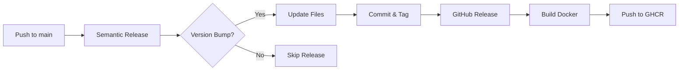

# Automated Release Guide

This project uses **Semantic Release** with **Conventional Commits** to automate versioning, changelog generation, and GitHub releases.

## How It Works

The release process is fully automated and triggered by commit messages following the [Conventional Commits](https://www.conventionalcommits.org/) specification.

### Version Bump Logic

Semantic Release analyzes commit messages to determine the next version:

- **`fix:`** or **`fix(scope):`** → **PATCH** version bump (1.2.1 → 1.2.2)
  - Bug fixes that don't change the API
  - Example: `fix: resolve pipeline failure at step 05a`

- **`feat:`** or **`feat(scope):`** → **MINOR** version bump (1.2.1 → 1.3.0)
  - New features that don't break existing functionality
  - Example: `feat: add initial QC filtering step`

- **`BREAKING CHANGE:`** or **`!`** in footer/body → **MAJOR** version bump (1.2.1 → 2.0.0)
  - Breaking changes that require user action
  - Example: `feat!: refactor pipeline architecture` or `feat(api)!: change config format`

- **`chore:`, `docs:`, `style:`, `refactor:`, `test:`** → **NO** version bump
  - Changes that don't affect the API or functionality
  - Example: `chore: update documentation`

### Commit Message Format

```
<type>(<scope>): <subject>

<body>

<footer>
```

**Required:**
- `<type>`: One of `fix`, `feat`, `chore`, `docs`, `style`, `refactor`, `test`, `perf`
- `<subject>`: Short description (imperative mood, lowercase, no period)

**Optional:**
- `<scope>`: Component affected (e.g., `pipeline`, `docker`, `docs`)
- `<body>`: Detailed description
- `<footer>`: Breaking changes or issue references

### Examples

#### Patch Release (1.2.1 → 1.2.2)
```bash
git commit -m "fix(pipeline): resolve config loading bug in step 05a"
```

#### Minor Release (1.2.1 → 1.3.0)
```bash
git commit -m "feat(qc): add comprehensive outlier tracking plot"
```

#### Major Release (1.2.1 → 2.0.0)
```bash
git commit -m "feat(pipeline)!: refactor step numbering scheme

BREAKING CHANGE: Step numbers changed from 07a/07b to 05a/05b"
```

Or using `!` in the type:
```bash
git commit -m "feat!(config): change YAML structure

BREAKING CHANGE: config.yaml structure has been restructured"
```

### What Happens on Release

When a release is triggered (by pushing to `main` or `master`):

1. **Version Detection**: Semantic Release fetches the latest Git tag to establish baseline
2. **Commit Analysis**: Analyzes commits since last release using Conventional Commits
3. **Version Calculation**: Determines next version (patch/minor/major)
4. **Version Synchronization**: Updates version in:
   - `VERSION` file
   - `Dockerfile` (LABEL and comment)
   - `README.md` (version references)
5. **Changelog Generation**: Creates/updates `CHANGELOG.md` with release notes
6. **Git Operations**:
   - Commits version changes with message: `chore(release): X.Y.Z [skip ci]`
   - Creates Git tag: `vX.Y.Z`
   - Pushes changes to repository
7. **GitHub Release**: Creates GitHub Release with changelog
8. **Docker Build**: Builds and pushes Docker image to GHCR with:
   - Tag: `vX.Y.Z`
   - Tag: `X.Y` (minor version)
   - Tag: `X` (major version)
   - Tag: `latest` (if on main/master branch)

### Workflow



### Manual Release (Skip CI)

If you need to trigger a release without version bump (e.g., documentation-only):

```bash
git commit -m "docs: update installation guide [skip release]"
```

Or to skip CI entirely:
```bash
git commit -m "chore: update dependencies [skip ci]"
```

### Troubleshooting

**Release not triggered?**
- Check commit message format (must follow Conventional Commits)
- Ensure commits are on `main` or `master` branch
- Verify `GITHUB_TOKEN` has write permissions

**Wrong version calculated?**
- Review commit history: `git log --oneline`
- Check if breaking changes are properly marked
- Verify latest tag: `git describe --tags --abbrev=0`

**Docker image not built?**
- Release must be published (version bump occurred)
- Check workflow logs for errors
- Verify GHCR permissions

### Best Practices

1. **Use descriptive commit messages**: Help future maintainers understand changes
2. **Scope commits appropriately**: Group related changes in single commit
3. **Mark breaking changes clearly**: Use `BREAKING CHANGE:` or `!` in type
4. **Test before pushing**: Ensure pipeline works before triggering release
5. **Review CHANGELOG.md**: Verify generated release notes are accurate

### Configuration Files

- **`.releaserc.json`**: Semantic Release configuration
- **`package.json`**: Node.js dependencies for semantic-release
- **`scripts/sync_version.sh`**: Version synchronization script
- **`.github/workflows/release.yml`**: GitHub Actions workflow

### Additional Resources

- [Conventional Commits Specification](https://www.conventionalcommits.org/)
- [Semantic Release Documentation](https://semantic-release.gitbook.io/)
- [GitHub Actions Documentation](https://docs.github.com/en/actions)
